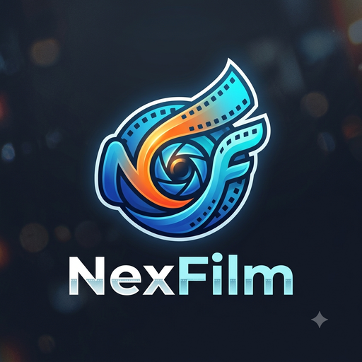

<p align="center">
  
</p>

<h1 align="center">NexFilm Engine</h1>

<p align="center">
  A film-negative conversion, color-grading, and roll-management desktop application.<br>
  面向胶片扫描工作流的负片转换、校色与胶卷管理桌面应用。
</p>

<p align="center">
  <a href="https://github.com/BillyDu-TJ/NexFilm/releases"></a>
  <a href="https://github.com/BillyDu-TJ/NexFilm/releases"></a>
  <a href="https://github.com/BillyDu-TJ/NexFilm/releases"></a>
</p>

<p align="center">
  <a href="https://github.com/BillyDu-TJ/NexFilm/actions/workflows/windows-release.yml"></a>
  <a href="https://github.com/BillyDu-TJ/NexFilm/actions/workflows/macos-release.yml"></a>
  <a href="LICENSE"></a>
  
</p>

<p align="center">
  <a href="#中文说明">中文</a> · <a href="#english">English</a>
</p>

---

<a id="中文说明"></a>

## 中文说明

> [!IMPORTANT]
> NexFilm Engine 仍处于开发阶段，界面、数据格式和校色结果可能发生变化。请保留原始扫描文件，并在批量处理前先用少量图片验证结果。Windows 与 macOS 预览包均未签名；macOS DMG 也尚未经过 Apple 公证。

### 下载与安装

#### [下载 Windows 开发预览版（安装程序）](https://github.com/BillyDu-TJ/NexFilm/releases)

#### [下载 macOS Apple Silicon 开发预览版（M 系列芯片）](https://github.com/BillyDu-TJ/NexFilm/releases)

#### [下载 macOS Intel x86_64 开发预览版](https://github.com/BillyDu-TJ/NexFilm/releases)

项目暂时没有正式稳定版。上面的按钮会打开 GitHub Releases 页面；在线构建发布后，请按以下步骤安装：

1. 打开最新的 **Pre-release**，展开页面底部的 **Assets**。
2. Windows 用户下载名称中包含 `nsis`、扩展名为 `.exe` 的安装程序。
3. Apple Silicon Mac 下载名称中包含 `aarch64` 的 `.dmg`；Intel Mac 下载名称中包含 `x86_64` 的 `.dmg`。在 macOS 的 **关于本机** 中可以查看芯片类型。
4. 不要下载 `Source code`，那是给开发者使用的源码。
5. Windows 双击安装程序并按提示完成安装。macOS 打开 DMG 后把 NexFilm 拖入 **Applications**；若 Gatekeeper 阻止首次启动，请在 Finder 中右键应用并选择 **打开**，确认文件来自本仓库后再继续。

如果 Releases 页面暂时没有对应的 `.exe` 或 `.dmg`，说明维护者尚未发布该平台的首个在线构建，并非下载按钮失效。请勿从不明网盘或第三方网站下载安装包。

### NexFilm 是什么

NexFilm Engine 用于把相机翻拍或扫描仪输出的胶片负片转换为正片，并把导入、校色、归档和输出组织在同一个工作区。项目采用 Rust、Tauri、SQLite 与 WebGL 构建；图片和胶卷资料保存在本地，不依赖云端图库。

### 主要功能

- **基于 Cineon 思路的密度域校色**：在线性透射率上进行 `-log10(T)` 密度转换、片基扣除和 Status M 思路的经验去串扰，并提供 D-Min、D-Max、曝光、Gamma、高光、阴影及分通道调节。
- **自动识别胶片边缘**：从导入预览中自动检测胶片范围，也可手动拖动四角进行透视校准；已确认的范围可批量应用到同卷其他画面。
- **按卷生命周期管理**：按画幅、相机、胶片型号和日期导入，支持胶卷归档、筛选、继续编辑、追加画面、缺失文件重定位和整卷删除。
- **自动画面识别与自动校色**：支持自动识别胶片成像范围，并且自动进行校色。
- **实时预览与几何工具**：使用 WebGL 进行交互预览，提供裁切、拉直、90 度旋转、水平/垂直翻转、直方图和波形图。
- **LUT 工作流**：内置多款打印胶片/相纸风格 LUT，同时支持载入自定义 `.cube` LUT 并调节强度。
- **批量导出**：支持 16/8 位 TIFF、16 位 PNG 和 JPEG，可选择原始尺寸或自定义长边、放大策略、四档输出锐化、JPEG 质量、命名模板和重名处理策略。
- **接触印样导出**：按胶卷生成带胶片型号、拍摄日期、相机和画面编号的高质量 JPEG contact sheet。
- **延迟 RAW 解码**：导入阶段优先提取嵌入预览，进入 Develop 后再准备 16 位线性代理，减少大批量导入时的等待。
- **本地持久化**：编辑参数、几何信息、缩略图和胶卷元数据写入本地 SQLite，可在重启后继续编辑。

### 快速使用教程

#### 1. 按卷导入

1. 启动 NexFilm，点击右上角 **Import Roll**。
2. 选择 **Import by Roll**。
3. 在 **Roll Metadata** 中选择胶片画幅、相机、胶片型号和日期。列表中没有的相机或胶片可以通过 **Add New** 添加。
4. 点击 **Select Images**，一次选择这一卷的全部扫描文件。建议先按拍摄顺序整理文件名。
5. 等待导入进度完成。导入只建立工作集和预览，不会修改原始文件。

临时处理散张图片时，可选择 **Loose Import**，也可以把受支持的图片直接拖入窗口。每次散张导入会形成一个独立的 **Loose Import** 记录，因而也能在 **Rolls** 中继续编辑、修改元信息或删除。

Library 和 Develop 只显示当前工作卷：软件启动时工作区为空，每次新导入或从 Rolls 使用 **Promote to Library** 都会替换上一批画面，历史记录仍保留在 Rolls 中。

#### 2. 确认胶片范围并反相

1. 在 **Library** 选择画面，然后进入 **Develop**。
2. 首次编辑时，先在 **Film Area** 中点击 **Auto Area**。如果检测不准确，拖动四角，使边界落在有效胶片画面上，再点击 **Save Area**。
3. 同卷扫描位置一致时，点击 **Batch Apply**，把当前胶片范围应用到其他画面。
4. 点击 **Auto Invert** 生成正片；需要清理边框齿孔时，使用 **Sample Sprocket Hole** 采样一个齿孔。
5. 使用 D-Min/D-Max、曝光、Gamma、高光、阴影、RGB 通道、白平衡和 LUT 完成调整。顶部工具栏可裁切、拉直、旋转和翻转。
6. 使用 **Copy Settings / Paste Settings** 将一张画面的参数复制到其他相似画面。

#### 3. 批量导出成片

1. 回到 **Library**，点选需要输出的画面；需要全部输出时使用 **Select All**。
2. 点击右上角 **Export**。
3. 选择格式、尺寸、JPEG 质量、输出锐化、命名模板和重名处理策略。命名模板支持 {Roll}、{Camera}、{Film}、{Date}、{Original} 和 {Seq}。
4. 点击 **Choose folder** 选择文件夹，确认摘要后选择 **Export frames**。导出会在后台执行，期间仍可继续浏览和编辑。

16 位 TIFF 适合继续精修或存档；JPEG/PNG 更适合分享。正式批量输出前，请先导出一张检查裁切、颜色和锐化。

#### 4. 导出 Contact Sheet

1. 打开顶部 **Rolls**。
2. 点击一张胶卷卡片进入 **Roll Contents**。
3. 点击 **Export Contact Sheet**。
4. 选择保存位置。NexFilm 会生成 JPEG 接触印样；未完成校色的画面会以当前可用预览或占位状态呈现。

#### 5. 继续编辑旧胶卷

点击 **Import Roll**，选择 **Continue Editing Roll**，再选择归档中的胶卷。若原图被移动，使用 **Locate File** 重新指定文件。建议不要随意改动原始扫描文件的路径；NexFilm 数据库只保存编辑状态和文件路径，不会复制整套原图。

在 Library 选择任意画面、在 Develop 打开画面，或在 Rolls 选择胶卷后，都可以使用 **Remove Roll**。确认框可选择仅移除 NexFilm 记录，或同时永久删除磁盘源文件；仍被其他胶卷引用的同一路径会保留。在 Rolls 使用 **Edit Info** 可修改相机、胶片、日期和画幅。

### 支持的文件与输出

输入文件选择器支持常见相机 RAW（包括 DNG、NEF/NRW、CR2/CR3、ARW、RAF、RW2、ORF、PEF、3FR、IIQ、X3F 等）、Hasselblad/Imacon 扫描仪 FFF，以及 TIFF、JPEG、PNG。RAW 兼容性取决于内置 LibRaw；尚未验证的相机型号可能无法正确解码，请通过 [Issues](https://github.com/BillyDu-TJ/NexFilm/issues) 报告并注明相机型号、文件格式和错误信息。

输出支持 16 位 TIFF、8 位 TIFF、16 位 PNG 和 JPEG。可选择带有匹配 ICC 配置文件的 sRGB、Display P3、Adobe RGB (1998)、Rec.2020、ProPhoto RGB、ACEScg 或 ACES2065-1 输出。尺寸缩放保持宽高比；默认不放大源图，并默认在重名时添加后缀而不覆盖。

### v1.1 目标色彩管线（设计草案）

> [!IMPORTANT]
> 本节是 v1.1 的实现约束，不代表当前版本已经完成。Linear ProPhoto RGB 是统一的广色域正片工作空间，但不是“绝对光子数据”，也不应在未经验证时直接等同于胶片密度的测量域。内部主处理缓冲区应使用 `f32` 并保留超出 `[0, 1]` 的值；16 位整数只适合作为有明确定标和范围的缓存或文件格式。

#### 1. 输入识别与线性化

- **相机 RAW / 带拜尔阵列的 FFF**：解码为 Camera Native 线性响应；使用与相机、翻拍光源匹配的 DCP/输入配置文件，或 LibRaw 相机矩阵作为后备。密度分支只使用色度校准部分，不烘焙 DCP 的 Look Table、Tone Curve 或主观风格。
- **扫描仪 FFF**：按文件内容而不是仅按扩展名识别扫描仪 RGB。优先通过内嵌或指定的扫描仪 ICC 完成 TRC 反解和色彩变换；只有在没有可靠配置文件且编码曲线已知时，才使用 Gamma 1.8 等显式后备，避免重复去 Gamma。
- **带 ICC 的 TIFF/JPEG/PNG**：由内嵌配置文件一次性完成 TRC 反解，并经 PCS 转换到 Linear ProPhoto RGB。
- **无 ICC 的 JPEG/PNG**：默认按 sRGB 解释，同时在元数据中记录该假设。
- **无 ICC 的专业 TIFF**：不得静默猜测；要求用户选择输入配置文件和传递函数，例如“Adobe RGB，Gamma 2.2”或“Scanner RGB，Linear”。

该阶段应同时保留输入配置文件、白点、传递函数和设备标识。UI 中的 **Input Space** 表示源数据的解释方式；**Working Space: Linear ProPhoto RGB** 是固定的正片调色空间，两者不是同一个选项。

#### 2. 透射率与密度

1. 在可能时使用暗场和无片光源参考计算相对透射率：`T = (scan - dark) / (light - dark)`；没有参考帧时必须把结果标记为相对测量。
2. 在经过标定且保持正值的 **Density Input RGB** 中计算 `D = -log10(max(T, epsilon))`，并记录被下限替代的无效样本。不能以“ProPhoto 色域很大”为由假设变换后一定没有负值。
3. 扣除同一采集条件下的片基密度：`D_net = D_image - D_base`。
4. 彩色负片可应用已标定的设备/光源/胶片密度变换；未标定时使用 Identity 或明确标为 **Legacy Estimate** 的兼容矩阵。
5. 黑白负片在密度域合并为单通道。`0.2126 / 0.7152 / 0.0722` 只对应 Linear sRGB/Rec.709 坐标；若密度输入域改变，权重也必须由该域或实测响应推导，不能原样照搬。

这里必须保留一个关键约束：一般情况下 `-log10(Ax) != A[-log10(x)]`。因此不能用普通 RGB 基变换把现有矩阵从 Linear sRGB “换算”到 Linear ProPhoto。v1.1 可以把 Linear ProPhoto 作为统一交换与调色空间，但密度计算应留在经过验证的正值采集域；只有测试证明满足误差目标后，才能把 Linear ProPhoto 直接定义为 Density Input RGB。

#### 3. 反相与正片重建

- Rust 后端在统一密度数据上生成 65,536 档直方图，估计有效 D-Min/D-Max，并排除边框、齿孔、裁切外区域和无效样本。
- D-Min/D-Max 归一化、曝光、高光、阴影、白平衡及分通道参数必须声明作用域。当前兼容路径产生显示参考的正片信号；未来若要得到真正的场景线性 ProPhoto，应加入胶片型号/冲洗条件相关的特性曲线或经过验证的重建模型，不能只把归一化密度改名为“线性光”。
- Auto Invert 的估计值和用户调整保持可逆、可复制，并记录所用输入配置文件、密度校准配置和算法版本。

#### 4. 风格与输出

- LUT 必须声明预期输入域和传递函数；不明域的 `.cube` 只能作为显示参考风格使用。
- 场景线性路径执行 `Linear ProPhoto -> 目标线性 RGB -> 目标 OETF`；显示参考兼容路径必须先按其实际传递函数解码，再转换到目标空间。整个输出链只应用一次 OETF，避免重复 Gamma。
- WebGL 预览转换到显示 sRGB；导出可写入 16 位 TIFF/PNG 或 8 位 JPEG，并嵌入与像素编码一致的 ICC。量化和锐化只发生在最终输出端。

#### Status M 与标定边界

Status M 本质上是一组规定光谱响应的彩色密度测量条件，不是一个对所有相机、灯板和胶片都通用的去串扰矩阵。当前硬编码矩阵没有配套的测量数据、适用设备和误差报告，因此在工程上应视为绑定于当前处理域的经验估计；切换密度域后不能默认继续使用。

可行的标定方式是采集带参考 Status M 或光谱数据的透射目标、控制条或分层阶梯片，在固定相机、镜头、ISO、灯板光谱与曝光条件下获得 RAW 测量，然后拟合 `D_reference = A * D_capture + b`。应使用独立验证样本报告密度残差和最终色差，并把结果保存为带设备、光源、胶片及冲洗条件标识的版本化校准配置。

24 色卡适合建立相机/光源 DCP 或拟合端到端正片色彩，但不足以单独辨识负片三层染料串扰。RGB 窄谱灯板可以增加可观测性，但必须分别拍摄 R、G、B 三次、测量或记录各通道 SPD，并固定 RAW 曝光流程；一张三色合成白光照片无法独立求出三路响应。公开的胶片特性曲线和控制条目标值可以作为参考，不能替代本机采集系统与实物样本的成对测量。

### 赞赏

如果 NexFilm 对你的胶片工作流有所帮助，欢迎分别支持软件作者与 UI 设计师。赞赏完全自愿，不影响软件功能、开源许可或问题处理优先级。

<table align="center">
  <tr>
    <td align="center"><strong>软件作者 Billy_Du</strong><br></td>
    <td align="center"><strong>UI 设计师 lonely-xmw</strong><br></td>
  </tr>
</table>

- 作者联系方式：GitHub [@BillyDu-TJ](https://github.com/BillyDu-TJ)，邮箱 [790704944@qq.com](mailto:790704944@qq.com) / [duzhongtao188@gmail.com](mailto:duzhongtao188@gmail.com)
- UI 设计师联系方式：GitHub [@lxmw44426-tech](https://github.com/lxmw44426-tech)，邮箱 [lxmw44426@gmail.com](mailto:lxmw44426@gmail.com)

### 数据、隐私与备份

- Windows Release 构建把数据库和胶卷兼容数据保存在 `%APPDATA%\NexFilm Engine\`。macOS 当前使用 `$XDG_DATA_HOME/NexFilm Engine/`，未设置该变量时使用 `~/.local/share/NexFilm Engine/`；Debug 构建保存在仓库工作目录。
- NexFilm 不会覆盖原始扫描文件，导出会写入用户选择的文件夹。
- 数据库保存文件路径、胶卷资料、编辑参数和预览图。它不是原始图片备份，请同时备份原图与 `nexfilm_user.db`。
- 当前界面样式通过 Tailwind CDN 加载，因此预览版首次启动和正常显示界面需要网络连接。离线资源打包仍在开发中。

### 本地开发环境

目前主要开发平台为 Windows 10/11 x64；仓库同时提供 macOS Apple Silicon 与 Intel 的 CI 打包配置。

#### Windows 前置条件

1. 安装 [Rust stable（rustup）](https://rustup.rs/)。
2. 安装 [Microsoft C++ Build Tools](https://visualstudio.microsoft.com/visual-cpp-build-tools/)，勾选 **Desktop development with C++** 和 Windows SDK。
3. 安装或启用 [Microsoft Edge WebView2 Runtime](https://developer.microsoft.com/microsoft-edge/webview2/)。Windows 10/11 通常已预装。
4. 安装 Node.js LTS。前端没有 npm 构建步骤，但项目校验脚本需要 Node.js。
5. 当前 UI 从 Tailwind CDN 加载样式，开发运行时需要联网。

#### macOS 前置条件

1. 运行 `xcode-select --install` 安装 Xcode Command Line Tools。
2. 安装 [Rust stable（rustup）](https://rustup.rs/) 与 Node.js LTS。
3. 安装 Tauri CLI：`cargo install tauri-cli --version "^2" --locked`。
4. 当前 UI 从 Tailwind CDN 加载样式，开发运行时需要联网。

#### 获取代码并运行

```powershell
git clone https://github.com/BillyDu-TJ/NexFilm.git
cd NexFilm
cargo install tauri-cli --version "^2" --locked
cargo tauri dev
```

首次编译会下载 Rust 依赖并编译随仓库提供的 LibRaw 源码，耗时会明显长于后续增量编译。

#### 运行检查

```powershell
cargo fmt --check
cargo check --locked
cargo test --locked --lib
node --check ui/main.js
node --check ui/geometry.js
node scripts/verify-geometry-contract.cjs
node scripts/verify-ui-startup-order.cjs
node scripts/verify-webgl-shaders.cjs
```

#### 本地生成 Windows 安装包

```powershell
cargo tauri build --bundles nsis
```

安装程序会生成在 `target/release/bundle/nsis/`。项目当前使用 CDN 样式资源，因此构建成功不代表安装包已经能够完全离线运行。

#### 本地生成 macOS DMG

```bash
rustup target add aarch64-apple-darwin x86_64-apple-darwin
cargo tauri build --target aarch64-apple-darwin --bundles dmg
cargo tauri build --target x86_64-apple-darwin --bundles dmg
```

DMG 会生成在对应目标目录的 `release/bundle/dmg/` 下。跨架构构建依赖 Apple 工具链；如本机构建失败，可使用下述 GitHub Actions 工作流。

### 维护者：使用 GitHub 在线构建

仓库已提供 **Build Windows Preview** 与 **Build macOS Preview** 两个手动工作流。前者构建 Windows x64 NSIS 安装程序；后者依次构建 Apple Silicon 和 Intel DMG。两者都会把结果发布到 Releases，而不是只保存为会过期、且下载时通常需要登录的 Actions Artifact。

1. 先在 `Cargo.toml` 和 `tauri.conf.json` 中同步更新版本号并推送代码。
2. 打开仓库的 **Actions**，选择 **Build Windows Preview**，点击 **Run workflow**，输入唯一标签，例如 `v0.1.0-preview.1`。
3. Windows 工作流完成后，再运行 **Build macOS Preview**，输入完全相同的标签。请勿让两个发布工作流并发运行。
4. 构建成功后，同一条预发布中会包含 Windows `.exe`、Apple Silicon `.dmg` 和 Intel `.dmg`，README 顶部下载按钮无需改动。

工作流只会手动运行，不会在每次提交时公开一个不完整版本。macOS 工作流内部将两个架构串行构建，避免同时创建同一 Release。正式版就绪时，可将两个工作流中的 `prerelease` 改为 `false`，并使用正式版本标签。

### 已知限制与开发计划

- 项目仍在开发中，尚未完成覆盖多相机型号的 RAW 兼容性和性能验证。
- Windows 安装包尚未代码签名，可能触发系统安全提示。
- macOS DMG 尚未代码签名或 Apple 公证，且首次 GitHub 托管的双架构构建仍需实际运行验证。
- UI 资源尚未完全本地化，离线打包仍待完成。
- Linux 暂无经过验证的安装包。
- 仍需持续验证 WebGL 预览与全尺寸导出在更多真实 RAW 文件上的像素级一致性。

### 反馈与贡献

提交问题前请先搜索现有 [Issues](https://github.com/BillyDu-TJ/NexFilm/issues)。Bug 报告请包含系统版本、相机/扫描仪型号、输入格式、复现步骤和错误信息；请勿上传包含隐私内容的原片。代码贡献请保持改动聚焦，并在 Pull Request 中写明验证命令与结果。


### 作者、联系与许可

- 作者：Billy_Du (GitHub：[@BillyDu-TJ](https://github.com/BillyDu-TJ))
- 特别鸣谢：UI设计由 lonely-xmw (Github: [@lxmw44426-tech](https://github.com/lxmw44426-tech)，邮箱：[lxmw44426@gmail.com](mailto:lxmw44426@gmail.com))
- 鸣谢与参考：去色罩的理论参考了知乎 `@黄昊Haosky` 与 `@V777` 两位大佬。他们为科学去色罩提供了坚实的理论基础。
- 联系邮箱：[790704944@qq.com](mailto:790704944@qq.com) 或者 [duzhongtao188@gmail.com](mailto:duzhongtao188@gmail.com)
- 问题反馈：[GitHub Issues](https://github.com/BillyDu-TJ/NexFilm/issues)
- 开源许可：[GNU General Public License v3.0 only](LICENSE)。你可以使用、研究和修改本项目；分发本项目或其修改版本时，必须按 GPLv3 提供相应源码、保留许可声明，并以相同许可证发布衍生作品。软件按“原样”提供，不附带任何担保。

---

<a id="english"></a>

## English

> [!IMPORTANT]
> NexFilm Engine is under active development. Its interface, data format, and color output may change. Keep your original scans and validate a small batch before processing a full archive. Windows and macOS previews are unsigned, and macOS DMGs are not notarized by Apple.

### Download and install

#### [Download the Windows preview installer](https://github.com/BillyDu-TJ/NexFilm/releases)

#### [Download the macOS Apple Silicon preview (M-series chips)](https://github.com/BillyDu-TJ/NexFilm/releases)

#### [Download the macOS Intel x86_64 preview](https://github.com/BillyDu-TJ/NexFilm/releases)

There is no stable release yet. Once an online build has been published, use the Releases page as follows:

1. Open the newest **Pre-release** and expand **Assets** at the bottom.
2. On Windows, download the `.exe` installer whose name contains `nsis`.
3. On Apple Silicon, download the `.dmg` containing `aarch64`; on an Intel Mac, download the `.dmg` containing `x86_64`. **About This Mac** shows the Mac's chip type.
4. Do not download `Source code`; those archives are for developers.
5. Run the Windows installer, or open the DMG and drag NexFilm into **Applications**. If macOS Gatekeeper blocks first launch, right-click the app in Finder and choose **Open** after confirming that it came from this repository.

If the matching `.exe` or `.dmg` is absent, the first preview for that platform has not been published. Do not download NexFilm from an unofficial mirror.

### What is NexFilm?

NexFilm Engine converts camera-scanned or scanner-produced film negatives into positives while keeping import, grading, archiving, and export in one workspace. It is built with Rust, Tauri, SQLite, and WebGL. Images and roll metadata remain local; no cloud library is required.

### Features

- **Cineon-inspired density-domain grading** using `-log10(T)` density conversion, film-base subtraction, an empirical Status-M-inspired crosstalk transform, D-Min/D-Max, exposure, gamma, highlights, shadows, and per-channel controls.
- **Automatic film-edge detection**, manual four-corner perspective calibration, and batch application of a confirmed film area to other frames.
- **Roll lifecycle management** with format, camera, film stock, and date metadata; archive filters; continue editing; append frames; relocate missing files; and roll deletion.
- **Automatic Edge Recognition and Automatic Reverse**, enable to regonize film area automaticlly, and demask with a click.
- **Real-time WebGL preview and geometry tools**, including crop, straighten, quarter-turn rotation, horizontal/vertical flip, histogram, and waveform views.
- **LUT workflow** with bundled print-film/paper looks, custom `.cube` LUT loading, and opacity control.
- **Batch export** to 16-bit/8-bit TIFF, 16-bit PNG, or JPEG with original/custom long-edge sizing, optional enlargement, four sharpening presets, JPEG quality, filename tokens, and conflict policies.
- **Contact sheet export** to a high-quality JPEG labeled with film stock, date, camera, and frame numbers.
- **Deferred RAW decoding** that favors embedded previews during import and prepares a 16-bit linear proxy when a frame enters Develop.
- **Local persistence** of editing parameters, geometry, thumbnails, and roll metadata in SQLite.

### Quick tutorial

#### 1. Import a roll

1. Start NexFilm and select **Import Roll** in the upper-right corner.
2. Choose **Import by Roll**.
3. In **Roll Metadata**, select the film format, camera, film stock, and date. Use **Add New** for an item that is not listed.
4. Select **Select Images** and choose every scan from the roll in one operation. Sorting filenames into shooting order first is recommended.
5. Wait for import to finish. Import creates a working set and previews; it does not alter source files.

For loose images, use **Loose Import** or drag supported files into the window. Each loose import becomes an independent **Loose Import** record, so it can also be resumed, edited, or removed from **Rolls**.

Library and Develop show only the current working roll. The workspace starts empty, and every new import or **Promote to Library** action replaces the previous batch while keeping its history in Rolls.

#### 2. Confirm the film area and invert

1. Select a frame in **Library**, then open **Develop**.
2. On first edit, choose **Auto Area** under **Film Area**. If detection is inaccurate, drag the four corners around the valid image area and select **Save Area**.
3. When scans from the roll share the same placement, use **Batch Apply** to copy the film area to other frames.
4. Select **Auto Invert** to create a positive. To clean up border perforations, use **Sample Sprocket Hole** on one sprocket hole.
5. Refine D-Min/D-Max, exposure, gamma, highlights, shadows, RGB channels, white balance, and LUT. Crop, straighten, rotate, and flip tools are in the top toolbar.
6. Use **Copy Settings / Paste Settings** to transfer a grade between similar frames.

#### 3. Batch export finished images

1. Return to **Library** and select the frames to export, or use **Select All**.
2. Select **Export** in the upper-right corner.
3. Choose format, size, JPEG quality, output sharpening, filename template, and conflict policy. Templates support {Roll}, {Camera}, {Film}, {Date}, {Original}, and {Seq}.
4. Select **Choose folder**, review the summary, and select **Export frames**. Export runs in the background, so browsing and editing can continue.

Use 16-bit TIFF for further editing or archival output; JPEG/PNG are more convenient for sharing. Export one test frame before starting a full batch.

#### 4. Export a contact sheet

1. Open **Rolls** in the top navigation.
2. Select a roll card to enter **Roll Contents**.
3. Select **Export Contact Sheet**.
4. Choose a save location. NexFilm generates a JPEG contact sheet; undeveloped frames use the best available preview or a placeholder.

#### 5. Continue an archived roll

Select **Import Roll**, then **Continue Editing Roll**, and choose a roll from the archive. If source images have moved, use **Locate File**. Avoid moving source scans unnecessarily: the database stores edit state and source paths, not a second copy of the originals.

Use **Remove Roll** after selecting a frame in Library, while viewing a frame in Develop, or after selecting a roll in Rolls. The confirmation dialog can remove only NexFilm records or permanently delete source files as well; paths still referenced by another roll are kept. Use **Edit Info** in Rolls to change the camera, film stock, date, or format.

### Supported files and output

The input picker supports common camera RAW formats, including DNG, NEF/NRW, CR2/CR3, ARW, RAF, RW2, ORF, PEF, 3FR, IIQ, and X3F, plus Hasselblad/Imacon scanner FFF, TIFF, JPEG, and PNG. RAW support depends on the bundled LibRaw version. For an unverified camera, report failures through [Issues](https://github.com/BillyDu-TJ/NexFilm/issues) with the camera model, file format, and error message.

Export formats are 16-bit TIFF, 8-bit TIFF, 16-bit PNG, and JPEG. Output can be encoded as sRGB, Display P3, Adobe RGB (1998), Rec.2020, ProPhoto RGB, ACEScg, or ACES2065-1 with a matching embedded ICC profile. Resampling preserves aspect ratio and does not enlarge sources unless enabled.

### v1.1 target color pipeline (design draft)

> [!IMPORTANT]
> This section defines v1.1 implementation constraints; it does not describe a completed feature. Linear ProPhoto RGB is the common wide-gamut positive-image working space, not “absolute photon data,” and it must not automatically be treated as the film-density measurement domain. Primary processing buffers should be `f32` and preserve values outside `[0, 1]`; 16-bit integers are suitable only for explicitly scaled caches or file formats.

#### 1. Source identification and linearization

- **Camera RAW / mosaiced FFF**: decode Camera Native linear responses and use a camera-and-light-specific DCP/input profile, with the LibRaw camera matrix as a fallback. The density branch uses only the colorimetric calibration and does not bake in a DCP Look Table, Tone Curve, or creative look.
- **Scanner FFF**: identify scanner RGB from file contents, not the extension alone. Prefer an embedded or selected scanner ICC to invert the TRC and transform color in one operation. Use an explicit Gamma 1.8 fallback only when no reliable profile exists and that encoding is known, avoiding double gamma removal.
- **Profiled TIFF/JPEG/PNG**: invert the embedded profile's TRC once and transform through the PCS into Linear ProPhoto RGB.
- **Unprofiled JPEG/PNG**: assume sRGB and record that assumption in metadata.
- **Unprofiled professional TIFF**: never guess silently. Require an input profile and transfer-function choice such as “Adobe RGB, Gamma 2.2” or “Scanner RGB, Linear.”

The pipeline retains the input profile, white point, transfer function, and device identity. **Input Space** describes how source samples are interpreted; fixed **Working Space: Linear ProPhoto RGB** describes positive-image grading. They are not the same setting.

#### 2. Transmittance and density

1. Where available, compute relative transmittance from dark and clear-light references: `T = (scan - dark) / (light - dark)`. Mark results as relative measurements when references are absent.
2. Compute `D = -log10(max(T, epsilon))` in a calibrated, positive **Density Input RGB**, and track samples replaced by the lower bound. A large ProPhoto gamut does not guarantee non-negative transformed samples.
3. Subtract film-base density captured under the same conditions: `D_net = D_image - D_base`.
4. Color negatives may use a calibrated device/light/film density transform. Otherwise use Identity or a compatibility matrix explicitly named **Legacy Estimate**.
5. Combine black-and-white negatives in the density domain. The `0.2126 / 0.7152 / 0.0722` weights are specific to Linear sRGB/Rec.709 coordinates; another density domain requires derived or measured weights.

The core constraint is that, in general, `-log10(Ax) != A[-log10(x)]`. An ordinary RGB basis change therefore cannot convert the existing matrix from Linear sRGB to Linear ProPhoto. v1.1 may use Linear ProPhoto as the common interchange and grading space, but density computation stays in a validated positive capture domain unless testing demonstrates that Linear ProPhoto itself meets the defined error target as Density Input RGB.

#### 3. Inversion and positive reconstruction

- The Rust backend builds a 65,536-bin histogram over canonical density data, estimates effective D-Min/D-Max, and excludes borders, sprocket holes, cropped regions, and invalid samples.
- D-Min/D-Max normalization, exposure, highlight/shadow shaping, white balance, and per-channel controls must declare their signal domain. The compatibility path produces a display-referred positive signal. A genuinely scene-linear ProPhoto path requires a film-stock/process characteristic curve or another validated reconstruction model; normalized density cannot merely be renamed “linear light.”
- Auto Invert estimates and user adjustments remain reversible and copyable, with the input profile, density calibration, and algorithm version recorded alongside them.

#### 4. Look and output rendering

- A LUT must declare its expected input domain and transfer function. A `.cube` with unknown assumptions is treated only as a display-referred look.
- A scene-linear path performs `Linear ProPhoto -> linear destination RGB -> destination OETF`. A display-referred compatibility path first decodes its actual transfer function before conversion. Apply the OETF exactly once to avoid double gamma.
- WebGL preview converts to display sRGB. Export writes 16-bit TIFF/PNG or 8-bit JPEG with an ICC matching the pixel encoding. Quantization and output sharpening occur only at the final output boundary.

#### Status M and calibration boundary

Status M is a specified set of spectral responses for color-density measurement, not a universal crosstalk matrix for every camera, light panel, and film. The current hard-coded matrix has no accompanying measurement dataset, device scope, or error report, so it is an empirical estimate bound to the current processing domain. It must not be assumed valid after that domain changes.

A defensible calibration captures transmissive targets, control strips, or dye-layer step samples with reference Status M or spectral measurements. Acquire RAW measurements with fixed camera, lens, ISO, light-panel spectrum, and exposure, then fit `D_reference = A * D_capture + b`. Report density residuals and final color error on held-out samples, and store the result as a versioned calibration profile identified by device, illuminant, film stock, and process.

A 24-patch ColorChecker is useful for a camera/illuminant DCP or end-to-end positive color fit, but it cannot isolate negative-film dye-layer crosstalk by itself. A narrow-band RGB light panel improves observability only when R, G, and B are captured separately, each SPD is measured or recorded, and the RAW exposure procedure is fixed. One synthesized-white capture cannot identify the three responses independently. Published film curves and control-strip aims are useful references, but they do not replace paired measurements from the actual capture system and physical samples.

### Sponsorship

If NexFilm helps your film workflow, you may support the author and UI designer separately. Sponsorship is entirely optional and does not affect features, licensing, or issue priority.

<table align="center">
  <tr>
    <td align="center"><strong>Author: Billy_Du</strong><br></td>
    <td align="center"><strong>UI Designer: lonely-xmw</strong><br></td>
  </tr>
</table>

- Author contact: GitHub [@BillyDu-TJ](https://github.com/BillyDu-TJ), email [790704944@qq.com](mailto:790704944@qq.com) / [duzhongtao188@gmail.com](mailto:duzhongtao188@gmail.com)
- UI designer contact: GitHub [@lxmw44426-tech](https://github.com/lxmw44426-tech), email [lxmw44426@gmail.com](mailto:lxmw44426@gmail.com)

### Data, privacy, and backups

- Windows release builds store the database and compatibility data in `%APPDATA%\NexFilm Engine\`. macOS currently uses `$XDG_DATA_HOME/NexFilm Engine/`, falling back to `~/.local/share/NexFilm Engine/`; debug builds use the repository working directory.
- NexFilm does not overwrite source scans. Exports are written to the directory selected by the user.
- The database contains source paths, roll metadata, edit parameters, and previews. It is not a backup of the source images; back up both the originals and `nexfilm_user.db`.
- The current UI loads Tailwind from a CDN, so preview builds need a network connection for first startup and correct styling. Fully offline packaging is still in development.

### Local development setup

Windows 10/11 x64 is the primary development platform. CI packaging is also configured for Apple Silicon and Intel macOS.

#### Windows prerequisites

1. Install [Rust stable through rustup](https://rustup.rs/).
2. Install [Microsoft C++ Build Tools](https://visualstudio.microsoft.com/visual-cpp-build-tools/) with **Desktop development with C++** and a Windows SDK.
3. Install or enable the [Microsoft Edge WebView2 Runtime](https://developer.microsoft.com/microsoft-edge/webview2/). It is normally preinstalled on Windows 10/11.
4. Install Node.js LTS. There is no npm frontend build, but Node.js runs the repository verification scripts.
5. Keep an internet connection available while developing because the current UI loads Tailwind from its CDN.

#### macOS prerequisites

1. Run `xcode-select --install` to install the Xcode Command Line Tools.
2. Install [Rust stable through rustup](https://rustup.rs/) and Node.js LTS.
3. Install the Tauri CLI with `cargo install tauri-cli --version "^2" --locked`.
4. Keep an internet connection available because the current UI loads Tailwind from its CDN.

#### Clone and run

```powershell
git clone https://github.com/BillyDu-TJ/NexFilm.git
cd NexFilm
cargo install tauri-cli --version "^2" --locked
cargo tauri dev
```

The first build downloads Rust dependencies and compiles the vendored LibRaw sources, so it takes substantially longer than subsequent incremental builds.

#### Run verification

```powershell
cargo fmt --check
cargo check --locked
cargo test --locked --lib
node --check ui/main.js
node --check ui/geometry.js
node scripts/verify-geometry-contract.cjs
node scripts/verify-ui-startup-order.cjs
node scripts/verify-webgl-shaders.cjs
```

#### Build a Windows installer locally

```powershell
cargo tauri build --bundles nsis
```

The installer is written to `target/release/bundle/nsis/`. Because the current UI uses CDN styling, a successful build does not yet imply a fully offline installer.

#### Build macOS DMGs locally

```bash
rustup target add aarch64-apple-darwin x86_64-apple-darwin
cargo tauri build --target aarch64-apple-darwin --bundles dmg
cargo tauri build --target x86_64-apple-darwin --bundles dmg
```

DMGs are written below each target's `release/bundle/dmg/` directory. Cross-architecture builds depend on the Apple toolchain; use the GitHub Actions workflow below if local cross-building fails.

### Maintainers: build online with GitHub Actions

The repository includes manual **Build Windows Preview** and **Build macOS Preview** workflows. The former creates a Windows x64 NSIS installer; the latter serially creates Apple Silicon and Intel DMGs. Both publish through Releases instead of relying only on expiring Actions artifacts that generally require a signed-in GitHub account to download.

1. Update the version in both `Cargo.toml` and `tauri.conf.json`, then push the code.
2. Open **Actions**, run **Build Windows Preview**, and enter a unique tag such as `v0.1.0-preview.1`.
3. After Windows finishes, run **Build macOS Preview** with the exact same tag. Do not run the two publishing workflows concurrently.
4. The same pre-release will contain the Windows `.exe`, Apple Silicon `.dmg`, and Intel `.dmg`. The README download buttons do not need to change.

The workflows are manual, so incomplete commits do not automatically become public builds. The macOS matrix is serialized to avoid concurrent creation of one Release. For a stable version, set `prerelease` to `false` in both workflows and use a stable version tag.

### Known limitations and roadmap

- The project is under development; broad RAW camera compatibility and performance testing are incomplete.
- Windows installers are not code-signed and may trigger an operating-system warning.
- macOS DMGs are neither code-signed nor Apple-notarized, and the first GitHub-hosted dual-architecture build still needs to be run and verified.
- UI resources are not fully vendored, so offline packaging remains incomplete.
- There is no verified Linux installer yet.
- Pixel-level consistency between WebGL preview and full-resolution export still needs validation against a wider set of real RAW files.

### Feedback and contributions

Search existing [Issues](https://github.com/BillyDu-TJ/NexFilm/issues) before opening a new report. A useful bug report includes the operating-system version, camera/scanner model, input format, reproduction steps, and error message. Do not upload private scans. Keep code contributions focused and include verification commands and results in the pull request.


### Author, contact, and license

- Author: Billy_Du (GitHub: [@BillyDu-TJ](https://github.com/BillyDu-TJ))
- Special Thank：UI Design: lonely-xmw (GitHub: [@lxmw44426-tech](https://github.com/lxmw44426-tech), email: [lxmw44426@gmail.com](mailto:lxmw44426@gmail.com))
- Acknowledgement：The theory of demask comes from Zhihu User `@黄昊Haosky` and `@V777`. They laid a solid theoretical foundation for scientific demask algorithm.
- Email: [790704944@qq.com](mailto:790704944@qq.com) or [duzhongtao188@gmail.com](mailto:duzhongtao188@gmail.com)
- Support: [GitHub Issues](https://github.com/BillyDu-TJ/NexFilm/issues)
- License: [GNU General Public License v3.0 only](LICENSE). You may use, study, and modify the project. Distribution of the project or modified versions must provide the corresponding source, preserve license notices, and license derivative works under the same GPLv3 terms. The software is provided as-is, without warranty.
