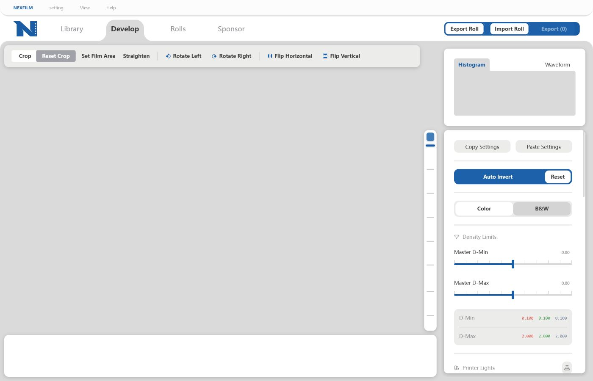

  

<h1 align="center">NexFilm Engine</h1>

  Film-negative conversion, color grading, and roll management in one local desktop workspace. 
  集负片转换、校色、胶卷管理与高质量输出于一体的本地桌面应用。

  
  
  

  
  
  

  <a href="#中文说明">中文</a> · <a href="#english">English</a>

  

NexFilm Engine · Develop 工作区 / Develop workspace · 浅色主题 / Light theme

---

## 中文说明

> [!IMPORTANT]
> NexFilm Engine v1.1.0 是当前稳定版本。Windows 与 macOS 安装包目前未进行代码签名，macOS DMG 也未经过 Apple 公证。请只从本仓库的 Releases 下载，并始终保留原始扫描文件；正式批量输出前，建议先导出少量画面检查结果。

### 下载与安装

从 [GitHub Releases](https://github.com/BillyDu-TJ/NexFilm/releases/latest) 下载与电脑架构匹配的 v1.1.0 安装包：

| 平台 | 下载文件 | 安装方式 |
| --- | --- | --- |
| Windows 10/11 x64 | x64 <code>.exe</code> 安装程序 | 双击并按提示安装；未签名版本可能触发 SmartScreen |
| macOS Apple Silicon | 文件名含 <code>aarch64</code> 的 <code>.dmg</code> | 打开 DMG，将 NexFilm Engine 拖入 Applications |
| macOS Intel | 文件名含 <code>x86_64</code> 的 <code>.dmg</code> | 打开 DMG，将 NexFilm Engine 拖入 Applications |

不要下载 Releases 中自动生成的 <code>Source code</code> 压缩包，它们不是可直接运行的安装包。若 macOS 阻止首次启动，请先确认文件来自本仓库，再在 Finder 中右键应用并选择 **打开**，或前往 **系统设置 → 隐私与安全性** 允许启动。

### v1.1.0 更新内容

本版的主题是把**输入类型与密度数学分开**：输入类型只决定"这段数据属于什么输入域"，反相与密度计算全部使用同一套实现。相机 RAW、扫描仪 TIFF 与 Imacon/Flextight FFF 因此得到一致、可解释的结果。

新功能：

- **统一密度管线**：输入域（内嵌 ICC、扫描仪容器记录、RAW 元数据、机型识别或 sRGB 兜底）逐帧解析并记录在技术报告中；密度数学统一为逐通道扣除片基 → 光学密度 → 共享窗口原点 → 有界通道跨度响应。跨度响应只在三通道确实失衡时介入，正常素材不受影响。
- **整卷白点与批量反相**：按整卷最亮的真实画面标定一次共享白点；片基与片头被采样的画面视为标定素材，自动排除在 Develop、白点测量与批量反相之外，并在进度中报告跳过数量。
- **硬件校正（实验性）**：**该功能仍在开发，当前不稳定，请不要将其投入严肃使用。** 新增硬件校正视图与校正配置，可收集 dark / open gate / flat / 透射目标，生成带验证报告的配置并绑定到胶卷；Capture Corrected 让 dark/open 真正参与像素计算，Capture Separation 3×3 可由实测色卡拟合。条件不满足时自动回退到 Smart Auto 并说明原因。
- **新的交付格式**：线性 16 位 TIFF、线性 DNG，以及原样封装扫描 RAW 的相机 RAW DNG。
- **胶卷备注**：每卷可填写备注，显示在归档卡片与胶卷内容中。
- **内置使用文档**：应用内新增 9 章中英双语文档，完全离线可读。

修复与优化：

- 扫描件改用按行流式解码：数百兆到 GB 级的 FFF、扫描仪 TIFF 与线性 DNG 都能打开，不再要求整幅图像驻留内存；大尺寸扫描件"Develop 能看、导出失败"的问题同时修复。
- `.fff` 识别不再依赖 FlexColor 写下的设备字符串。缺少该标记的 Imacon/Flextight 扫描件不会再被误判为哈苏相机 RAW —— 这正是 1.0.2 中"导入 fff 无法解码"的原因。
- 流式 TIFF 读取器增加几何与文件长度一致性校验：尺寸异常的头部现在给出明确错误，不再拖垮进程。
- 反相：短调画面保持原有影调性格；拼接白边、白灯板与高光溢出不再参与窗口端点；从其他画面继承的片基会在本画面自己的像素上重新测量。
- 散张导入与按卷未标定使用同一套密度数学，两者观感不再分叉。
- 导入阶段不再解算 RAW：首次进入 Develop 时才生成有界代理，导入更快、内存更可控。
- 界面：Develop 检查器重新分组，新增对比度并收紧曝光/高光/阴影范围；裁切与胶片范围共用同一画面坐标系；打开画面不再自动取消遮罩。
- 数据改为每用户数据目录，胶卷元数据迁入 SQLite，散张导入同样持久化；修复旋转缩略图变形、裁切遮罩与缩放不同步、批量反相中断等回归。

升级提示：

- 升级后请对旧胶卷重新执行一次 **Auto Invert**。本次迁移会清除用旧密度配方渲染的缩略图，避免缩略图与实际渲染不一致。

### NexFilm 是什么

NexFilm Engine 用于将相机翻拍或扫描仪输出的胶片负片转换为正片，并把导入、反相、校色、胶卷归档和输出组织在同一个工作区。应用采用 Rust、Tauri、SQLite 与 WebGL 构建；图库、编辑状态和胶卷资料均保存在本地，核心工作流不依赖云端服务。

### 主要功能

- **胶卷与散张工作流**：按画幅、相机、胶片型号、日期和备注导入整卷，也可直接拖入散张；备注用于区分同一款胶片的多卷素材，并显示在胶卷卡片与胶卷资料中；支持继续编辑、追加画面、修改胶卷信息、筛选归档、重定位缺失文件和删除记录。
- **自动胶片范围识别**：自动检测有效成像区域，也可拖动四角或边缘手动修正；范围仅用于内容分析与边缘排除，不会自动改变画面透视。固定机位扫描时可将范围批量应用到同卷其他画面。
- **密度域反相与自动校色**：基于线性透射率进行密度转换、片基扣除与统一的通道响应补偿，输入域逐帧记录；提供 Color / B&W、D-Min / D-Max、Printer Lights、曝光、Gamma、对比度、高光、阴影、饱和度、色温和色调控制。算法细节见 [统一密度管线说明](docs/unified-density-pipeline.md) 与 [数据处理管线说明](data_process_pipeline_doc.md)。
- **整卷标定与实验性硬件校正**：可按卷标定共享白点并整卷自动反相；硬件校正视图可管理采集校正配置（dark / open gate / flat / 透射目标）与扫描仪输入配置，用于固定的翻拍或扫描设备。该部分仍标记为实验性。
- **实时 Develop 工作区**：WebGL 交互预览，支持裁切、拉直、透视、90 度旋转、水平/垂直翻转、缩放平移，以及直方图和波形图。
- **设置复制与批处理**：可按类别选择要复制的校色、LUT、齿孔和几何参数，再粘贴到其他相似画面。
- **打印胶片模拟**：内置 Kodak 与 Ilford 打印胶片/相纸风格 LUT，支持载入自定义 <code>.cube</code> LUT 并调节强度。
- **完整输出工具**：可导出选中画面或整卷，支持 16/8 位 TIFF、16 位 PNG、JPEG，以及线性 16 位 TIFF、线性 DNG 和相机 RAW DNG；提供输出色彩空间、尺寸、放大策略、锐化、JPEG 质量、命名模板、重名策略和可选 EXIF 胶卷信息。
- **胶卷接触印样**：生成带胶片型号、拍摄日期、相机和画面编号的 JPEG Contact Sheet。
- **本地化与主题**：提供中文/英文界面和浅色/深色主题；前端样式与使用文档均随安装包本地打包，可离线使用。

### 快速开始

#### 1. 导入

1. 点击右上角 **Import Roll**。
2. 整卷扫描选择 **Import by Roll**，填写画幅、相机、胶片和日期后选择图片；临时处理散张可选择 **Loose Import**，也可直接拖入窗口。
3. 导入过程会建立本地预览与编辑记录，不会复制或修改原始扫描文件。

Library 与 Develop 显示当前工作卷；历史胶卷保存在 **Rolls**。从 Rolls 使用 **Promote to Library**，或在导入菜单中选择 **Continue Editing Roll**，即可继续以前的工作。

#### 2. 确认范围并反相

1. 在 **Library** 选择画面并进入 **Develop**。
2. 首次编辑先选择 **Set Film Area → Auto Area**。检查检测结果，必要时拖动四角或边缘，再选择 **Save Area**。
3. 同卷画面位置一致时使用 **Batch Apply**；位置不一致时应逐张确认。
4. 选择 **Auto Invert** 生成正片，再使用密度、Printer Lights、Aesthetics、Color Balance 和 LUT 完成调整。
5. 齿孔或边框干扰校色时，可使用 **Sample Sprocket Hole** 采样；相似画面可通过 **Copy Settings / Paste Settings** 复用参数。

#### 3. 导出与归档

1. 在 Library 选择画面，或进入 Rolls 后使用 **Export Roll** 输出整卷。
2. 在导出窗口设置格式、色彩空间、尺寸、锐化、命名模板与重名策略，然后选择目标文件夹。
3. 导出在后台执行，可继续浏览和编辑。正式批量导出前请先检查一张样片。
4. 在 **Rolls → Roll Contents** 中选择 **Export Contact Sheet** 可生成接触印样；源文件移动后使用 **Locate File** 重新关联。

16 位 TIFF 适合存档或继续精修；JPEG 适合日常分享。需要把结果交给其他软件继续调色时，可以选择线性 16 位 TIFF 或线性 DNG（线性光，不带显示曲线，并写入对应色彩空间）；需要原样归档扫描的 RAW 数据时，可以选择相机 RAW DNG，它不参与任何调整，仅适用于相机 RAW 素材，其余画面请改用线性 DNG。命名模板支持 <code>{Roll}</code>、<code>{Camera}</code>、<code>{Film}</code>、<code>{Date}</code>、<code>{Original}</code> 和 <code>{Seq}</code>。

### 文件格式与色彩输出

输入选择器支持常见相机 RAW，包括 DNG、NEF/NRW、CR2/CR3、ARW/SRF/SR2、RAF、RW2、ORF/ORI、SRW、PEF、3FR、ERF、KDC/DCR、IIQ、MOS、MRW、X3F、RWL、FFF 和 RAW，以及 TIFF、JPEG、PNG。RAW 与 FFF 兼容性取决于内置解码器和具体设备；遇到问题时请在 [Issues](https://github.com/BillyDu-TJ/NexFilm/issues) 中注明相机或扫描仪型号、文件格式与错误信息。

> [!WARNING]
> Nikon Z8 使用 **HE/HE*** 高效率 RAW 压缩格式拍摄的 NEF 文件目前无法导入，因为 LibRaw 暂不支持解码该格式。此限制当前无法在 NexFilm 内修复；如需导入，请在相机中改用 LibRaw 支持的 RAW 记录格式。

由于 JPEG 难以获得线性数据，且扫描仪出图几乎没有片基部分，因此不能保证校色效果。请使用 JPEG 时注意校色效果，在效果较差时自行
通过 RGB 补偿完成校色。

输出格式为 16 位 TIFF、8 位 TIFF、16 位 PNG 和 8 位 JPEG。可嵌入与像素编码匹配的 sRGB、Display P3、Adobe RGB (1998)、Rec.2020、ProPhoto RGB、ACEScg 或 ACES2065-1 ICC 配置文件。尺寸调整保持宽高比，默认不会放大小图，也不会在重名时静默覆盖文件。

### 数据、隐私与备份

- Windows 正式版数据目录：<code>%APPDATA%\NexFilm Engine\\</code>
- macOS 正式版数据目录：<code>~/Library/Application Support/NexFilm Engine/</code>
- Debug 构建默认在仓库工作目录保存数据
- 主要数据库文件：<code>nexfilm_user.db</code>；<code>rolls.json</code> 是兼容镜像

数据库保存源文件路径、胶卷资料、编辑参数和预览图，但不会保存一套完整原图。NexFilm 不会覆盖源扫描文件；请同时备份原图和数据目录。移动原图后需在应用内使用 **Locate File** 重新定位。

### 本地开发

Windows 10/11 x64 是主要开发平台；GitHub Actions 同时构建 macOS Apple Silicon 和 Intel 版本。

前置条件：

- Rust stable 与 Tauri CLI 2
- Windows：Microsoft C++ Build Tools、Windows SDK、WebView2 Runtime
- macOS：Xcode Command Line Tools
- Node.js LTS，用于运行前端校验脚本

~~~powershell
git clone https://github.com/BillyDu-TJ/NexFilm.git
cd NexFilm
cargo install tauri-cli --version "^2" --locked
cargo tauri dev
~~~

首次编译会下载 Rust 依赖并编译随仓库提供的 LibRaw 源码，因此明显慢于后续增量编译。

常用检查：

~~~powershell
cargo fmt --check
cargo check --locked
cargo test --locked --lib
node --check ui/main.js
node --check ui/geometry.js
node --check ui/contact-sheet.js
node --check ui/density-math.js
node scripts/verify-contact-sheet.cjs
node scripts/verify-density-contract.cjs
node scripts/verify-histogram-contract.cjs
node scripts/verify-geometry-contract.cjs
node scripts/verify-i18n-contract.cjs
node scripts/verify-library-management-contract.cjs
node scripts/verify-ui-startup-order.cjs
node scripts/verify-webgl-shaders.cjs
~~~

本地打包：

~~~powershell
# Windows
cargo tauri build --bundles nsis
~~~

~~~bash
# macOS
cargo tauri build --target aarch64-apple-darwin --bundles dmg
cargo tauri build --target x86_64-apple-darwin --bundles dmg
~~~

### 维护者：发布 v1.1.0

仓库使用单一的手动工作流 [Build and Release NexFilm 1.1.0](https://github.com/BillyDu-TJ/NexFilm/actions/workflows/release.yml)。运行时输入标签 <code>v1.1.0</code>；工作流会先执行 Rust 与前端校验，随后并行构建 Windows x64、macOS Apple Silicon 和 macOS Intel 安装包，并发布为正式 GitHub Release。

发布前请确认 <code>Cargo.toml</code>、<code>Cargo.lock</code> 与 <code>tauri.conf.json</code> 均为 <code>1.1.0</code>，应用内文档与 README 的版本号已同步，提交并推送全部发布文件，再从 Actions 手动运行一次工作流。当前配置为 <code>releaseDraft: false</code>、<code>prerelease: false</code>。

### 已知限制

- Windows 和 macOS 安装包尚未进行代码签名；macOS DMG 尚未经过 Apple 公证。
- 不同 RAW 相机、扫描仪与 FFF 文件的兼容性仍需持续验证。
- Nikon Z8 的 HE/HE* 高效率 RAW 压缩格式暂时无法由 LibRaw 解码。
- 硬件校正相关能力（Capture Corrected、Capture Characterized、扫描仪输入配置）仍为实验性，需要在真实设备素材上继续验证。
- 超大 JPEG/PNG 受解码器内存上限约束，可能提示解码失败，建议改用 TIFF 或 DNG。
- 全分辨率导出大型扫描件需要较大的可用内存。
- Linux 暂无经过验证的正式安装包。
- 数据库引用原始文件路径，不会复制原图；移动或删除源文件会导致画面离线。
- WebGL 预览与全尺寸导出仍需在更多真实 RAW 文件上持续进行像素级一致性验证。

### 赞赏

如果 NexFilm 对你的胶片工作流有所帮助，欢迎分别支持软件作者与 UI 设计师。赞赏完全自愿，不影响软件功能、开源许可或问题处理优先级。

<table align="center">
  <tr>
    <td align="center"><strong>软件作者 Billy_Du</strong> </td>
    <td align="center"><strong>UI 设计师 lonely-xmw</strong> </td>
  </tr>
</table>

### 反馈、鸣谢与许可

- 问题反馈：[GitHub Issues](https://github.com/BillyDu-TJ/NexFilm/issues)
- 软件作者：Billy_Du，GitHub [@BillyDu-TJ](https://github.com/BillyDu-TJ)，邮箱 [790704944@qq.com](mailto:790704944@qq.com) / [duzhongtao188@gmail.com](mailto:duzhongtao188@gmail.com)
- UI 设计：lonely-xmw，GitHub [@lxmw44426-tech](https://github.com/lxmw44426-tech)，邮箱 [lxmw44426@gmail.com](mailto:lxmw44426@gmail.com)
- 理论参考：感谢知乎用户 <code>@黄昊Haosky</code> 与 <code>@V777</code> 对科学去色罩理论的分享
- 开源许可：[GNU General Public License v3.0 only](LICENSE)

提交 Bug 时请包含系统版本、设备型号、输入格式、复现步骤和错误信息，并避免上传含隐私内容的原片。代码贡献请保持改动聚焦，并在 Pull Request 中写明验证方式。

---

## English

> [!IMPORTANT]
> NexFilm Engine v1.1.0 is the current stable release. Windows and macOS packages are currently unsigned, and macOS DMGs are not notarized by Apple. Download only from this repository's Releases page, keep the original scans, and test a small export before processing a full roll.

### Download and install

Download the v1.1.0 package for your system from [GitHub Releases](https://github.com/BillyDu-TJ/NexFilm/releases/latest):

| Platform | Package | Installation |
| --- | --- | --- |
| Windows 10/11 x64 | x64 <code>.exe</code> installer | Run the installer; an unsigned build may trigger SmartScreen |
| macOS Apple Silicon | <code>.dmg</code> containing <code>aarch64</code> | Open the DMG and drag NexFilm Engine to Applications |
| macOS Intel | <code>.dmg</code> containing <code>x86_64</code> | Open the DMG and drag NexFilm Engine to Applications |

The automatically generated <code>Source code</code> archives are not application installers. If macOS blocks the first launch, verify that the DMG came from this repository, then right-click the app in Finder and choose **Open**, or allow it under **System Settings → Privacy & Security**.

### What's new in v1.1.0

The theme of this release is separating **what the input is** from **how density is computed**. The input class now selects only the input domain; inversion and density use one shared implementation, which gives camera RAW, scanner TIFF, and Imacon/Flextight FFF files consistent and explainable results.

New features:

- **Unified density pipeline.** The input domain (embedded ICC, scanner container record, RAW metadata, device identity, or an sRGB fallback) is resolved per frame and recorded in the technical report. Density is computed the same way everywhere: per-channel film-base subtraction, optical density, a shared window origin, and a bounded per-channel span response that only engages when the channels are genuinely unbalanced.
- **Roll white point and Roll auto invert.** One shared white point is measured on the brightest real photograph of the roll. Frames the base and leader were sampled from are treated as calibration material and stay out of Develop, out of the white-point measurement, and out of the Roll batch, which reports how many it skipped.
- **Hardware calibration (experimental).** **This feature is still under development thus not stable. Please do NOT use it in serious application.** A calibration view and configuration profile collect dark / open-gate / flat / transmission-target references and produce a validated, digest-stamped profile bound to a roll. Capture Corrected makes dark/open correction part of the pixel math, and Capture Separation is fittable from measured patches. When the conditions are not met the pipeline falls back to Smart Auto and says why.
- **Scanner input profiles** can be imported and bound to a roll, affecting both preview and export.
- **New delivery formats**: linear 16-bit TIFF, linear DNG, and camera RAW DNG that re-wraps a scan's own mosaic.
- **Per-roll notes**, shown on the roll card and in the roll contents.
- **In-app documentation**: nine chapters, in Chinese and English, fully offline.

Fixes and improvements:

- Scanner files are decoded row by row, so FFF, scanner TIFF, and linear DNG files from hundreds of megabytes to gigabytes open without ever fitting in memory. The same readers are used for export, fixing large scans that used to render in Develop and then fail to export.
- `.fff` classification no longer depends on the device string FlexColor writes. Imacon/Flextight scans without it are no longer mistaken for a Hasselblad camera back, which is what caused the "import fff cannot decode" reports against 1.0.2.
- The streaming TIFF reader now validates declared geometry against the file size, so an abnormal header returns a clear error instead of taking the process down.
- Inversion: short-tone frames keep their character, stitched white edges, light tables, and clipped highlights no longer set the window endpoints, and a film base inherited from another frame is re-measured on the frame's own pixels.
- Loose import and uncalibrated roll import now share one density recipe, so their results no longer diverge.
- Import no longer unpacks RAW: the bounded Develop proxy is built on first open, which makes imports faster and memory use more predictable.
- Interface: the Develop inspector is regrouped, a contrast control was added, and the exposure/highlight/shadow ranges were tightened; crop and film area share one frame coordinate system; opening a frame no longer cancels its mask.
- Data now lives in a per-user directory with roll metadata in SQLite, and loose imports persist across restarts. Rotated thumbnail deformation, crop-overlay desynchronization, and interrupted Roll batches were fixed.

Upgrade note:

- After upgrading, run **Auto Invert** once more on older rolls. This release's migration clears thumbnails rendered with the retired density recipe so the filmstrip cannot disagree with the actual render.

### What is NexFilm?

NexFilm Engine converts camera-scanned or scanner-produced film negatives into positives while keeping import, inversion, grading, roll archiving, and output in one workspace. It is built with Rust, Tauri, SQLite, and WebGL. The library, edit state, and roll metadata remain local; the core workflow does not require a cloud service.

### Features

- **Roll and loose-frame workflows** with format, camera, film stock, date, and note metadata. The note tells several rolls of the same film stock apart and appears on the roll card and in the roll details; drag-and-drop import, archived-roll editing, append, metadata editing, missing-file relocation, and deletion are all supported.
- **Automatic film-area detection**, with manual corner/edge adjustment and batch reuse for consistently positioned scans. The detected area guides analysis and edge exclusion without automatically changing image perspective.
- **Density-domain inversion and automatic grading** with per-channel film-base subtraction and one shared channel-response stage, with the input domain recorded per frame; Color / B&W modes, D-Min / D-Max, Printer Lights, exposure, gamma, contrast, highlights, shadows, saturation, temperature, and tint. See the [unified density pipeline](docs/unified-density-pipeline.md) and the [data-processing pipeline](data_process_pipeline_doc.md) for implementation details.
- **Roll calibration and experimental hardware calibration**: measure a shared roll white point and run Roll auto invert; the calibration view manages capture profiles (dark / open gate / flat / transmission target) and scanner input profiles for a fixed copy stand or scanner. This part is still marked experimental.
- **Real-time Develop workspace** powered by WebGL, with crop, straighten, perspective, quarter-turn rotation, horizontal/vertical flip, zoom/pan, histogram, and waveform.
- **Selective Copy Settings / Paste Settings** for grade, LUT, sprocket, and geometry groups.
- **Print-film emulation** with bundled Kodak and Ilford print-film/paper LUTs, custom <code>.cube</code> LUT loading, and opacity control.
- **Complete output tools** for selected frames or a full roll: 16/8-bit TIFF, 16-bit PNG, JPEG, linear 16-bit TIFF, linear DNG, and camera RAW DNG; output color space; resizing; optional enlargement; sharpening; JPEG quality; filename templates; conflict policies; and optional roll metadata in EXIF.
- **JPEG contact sheets** labeled with film stock, date, camera, and frame number.
- **English/Chinese UI and light/dark themes**, with the frontend styles and the documentation bundled for offline use.

### Quick start

#### 1. Import

1. Select **Import Roll** in the upper-right corner.
2. Use **Import by Roll** for a complete roll and enter its format, camera, film stock, and date. Use **Loose Import** or drag files into the window for individual scans.
3. Import creates local previews and edit records without copying or modifying the source scans.

Library and Develop show the current working roll; previous rolls remain under **Rolls**. Use **Promote to Library** or **Continue Editing Roll** to resume earlier work.

#### 2. Confirm the film area and invert

1. Select a frame in **Library** and open **Develop**.
2. On first edit, choose **Set Film Area → Auto Area**. Review the result, adjust corners or edges if needed, then choose **Save Area**.
3. Use **Batch Apply** only when the scans share the same placement.
4. Choose **Auto Invert**, then refine Density Limits, Printer Lights, Aesthetics, Color Balance, and LUT settings.
5. Use **Sample Sprocket Hole** when perforations or borders affect the grade, and **Copy Settings / Paste Settings** for similar frames.

#### 3. Export and archive

1. Select frames in Library, or use **Export Roll** from a roll view.
2. Choose the format, color space, dimensions, sharpening, filename template, conflict policy, and destination.
3. Export runs in the background. Check one test image before committing to a full batch.
4. Use **Export Contact Sheet** under **Rolls → Roll Contents**; use **Locate File** if source scans have moved.

16-bit TIFF is recommended for archival output or further editing; JPEG is convenient for sharing. Filename tokens are <code>{Roll}</code>, <code>{Camera}</code>, <code>{Film}</code>, <code>{Date}</code>, <code>{Original}</code>, and <code>{Seq}</code>.

### File formats and color output

The input picker supports common camera RAW formats, including DNG, NEF/NRW, CR2/CR3, ARW/SRF/SR2, RAF, RW2, ORF/ORI, SRW, PEF, 3FR, ERF, KDC/DCR, IIQ, MOS, MRW, X3F, RWL, FFF, and RAW, plus TIFF, JPEG, and PNG. RAW and FFF compatibility depends on the bundled decoder and the specific device. Report failures through [Issues](https://github.com/BillyDu-TJ/NexFilm/issues) with the camera or scanner model, file format, and error.

> [!WARNING]
> Nikon Z8 NEF files recorded with **HE/HE*** high-efficiency RAW compression cannot currently be imported because LibRaw does not support decoding this format. NexFilm cannot work around this limitation at present; use a RAW recording format supported by LibRaw when import compatibility is required.

Because JPEG is hard to get linear information, we DON'T guarantee the color calibration effect. So if you are unsatisfied about the result, please adjust Printer Light module to optimize. 

Exports are 16-bit TIFF, 8-bit TIFF, 16-bit PNG, 8-bit JPEG, linear 16-bit TIFF, linear DNG, or camera RAW DNG. NexFilm can embed a matching sRGB, Display P3, Adobe RGB (1998), Rec.2020, ProPhoto RGB, ACEScg, or ACES2065-1 ICC profile, and linear TIFF files carry the matching linear profile. Resizing preserves aspect ratio, does not enlarge by default, and does not silently overwrite name conflicts.

The linear and RAW formats are hand-off outputs. Linear TIFF and linear DNG hold the developed positive with no display curve, so another application can grade it further; linear DNG declares its colour space in the file itself. Camera RAW DNG re-wraps each frame's own RAW mosaic for archival, so grading, resizing, sharpening, and output color do not apply to it, and frames whose source is not a camera RAW file (TIFF, JPEG, or a scanner's linear DNG) are reported as failures instead — export those as linear DNG.

### Data, privacy, and backups

- Windows release data: <code>%APPDATA%\NexFilm Engine\\</code>
- macOS release data: <code>~/Library/Application Support/NexFilm Engine/</code>
- Debug builds: repository working directory
- Main database: <code>nexfilm_user.db</code>; <code>rolls.json</code> is a compatibility mirror

The database stores source paths, roll metadata, edit parameters, and previews, but not a complete copy of the originals. NexFilm never overwrites source scans. Back up both the originals and the application data directory, and use **Locate File** after moving source files.

### Local development

Windows 10/11 x64 is the primary development platform. GitHub Actions also packages Apple Silicon and Intel macOS builds.

Prerequisites:

- Rust stable and Tauri CLI 2
- Windows: Microsoft C++ Build Tools, Windows SDK, and WebView2 Runtime
- macOS: Xcode Command Line Tools
- Node.js LTS for frontend verification

~~~powershell
git clone https://github.com/BillyDu-TJ/NexFilm.git
cd NexFilm
cargo install tauri-cli --version "^2" --locked
cargo tauri dev
~~~

The first build downloads Rust dependencies and compiles the vendored LibRaw sources, so it is substantially slower than later incremental builds.

Run the verification commands listed in the [Chinese development section](#本地开发), or use the same checks run by the release workflow.

Local packaging:

~~~powershell
# Windows
cargo tauri build --bundles nsis
~~~

~~~bash
# macOS
cargo tauri build --target aarch64-apple-darwin --bundles dmg
cargo tauri build --target x86_64-apple-darwin --bundles dmg
~~~

### Maintainers: publish v1.1.0

The repository uses one manual workflow: [Build and Release NexFilm 1.1.0](https://github.com/BillyDu-TJ/NexFilm/actions/workflows/release.yml). Run it with tag <code>v1.1.0</code>. It verifies the Rust and frontend sources, then builds Windows x64, macOS Apple Silicon, and macOS Intel packages in parallel and publishes a stable GitHub Release.

Before running it, confirm that <code>Cargo.toml</code>, <code>Cargo.lock</code>, and <code>tauri.conf.json</code> contain version <code>1.1.0</code> and that the in-app documentation and README carry the same version, then commit and push every release file. The current workflow uses <code>releaseDraft: false</code> and <code>prerelease: false</code>.

### Known limitations

- Windows and macOS packages are unsigned; macOS DMGs are not Apple-notarized.
- Compatibility still needs broader validation across RAW cameras, scanners, and FFF variants.
- Nikon Z8 HE/HE* high-efficiency RAW compression is not currently decodable by LibRaw.
- Hardware calibration (Capture Corrected, Capture Characterized, scanner input profiles) is still experimental and needs validation on real hardware.
- Very large JPEG/PNG files are limited by the decoder's memory ceiling and may report a decode failure; prefer TIFF or DNG for those.
- Exporting a large scan at full resolution needs a substantial amount of free memory.
- No verified Linux release package is currently provided.
- The database references source paths and does not copy originals; moved or deleted files become unavailable until relocated.
- Pixel-level consistency between WebGL preview and full-resolution export continues to be tested against more real RAW files.

### Sponsorship

If NexFilm helps your film workflow, you may support the author and UI designer separately. Sponsorship is optional and does not affect features, licensing, or issue priority.

<table align="center">
  <tr>
    <td align="center"><strong>Author: Billy_Du</strong> </td>
    <td align="center"><strong>UI Designer: lonely-xmw</strong> </td>
  </tr>
</table>

### Feedback, credits, and license

- Support: [GitHub Issues](https://github.com/BillyDu-TJ/NexFilm/issues)
- Author: Billy_Du, GitHub [@BillyDu-TJ](https://github.com/BillyDu-TJ), email [790704944@qq.com](mailto:790704944@qq.com) / [duzhongtao188@gmail.com](mailto:duzhongtao188@gmail.com)
- UI design: lonely-xmw, GitHub [@lxmw44426-tech](https://github.com/lxmw44426-tech), email [lxmw44426@gmail.com](mailto:lxmw44426@gmail.com)
- Theory references: thanks to Zhihu users <code>@黄昊Haosky</code> and <code>@V777</code> for sharing work on scientific film-mask removal
- License: [GNU General Public License v3.0 only](LICENSE)

Bug reports should include the operating-system version, device model, input format, reproduction steps, and error message. Do not upload private scans. Keep code contributions focused and include verification details in the pull request.
