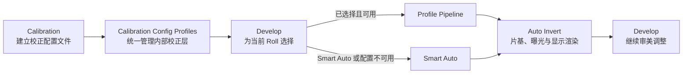

# NexFilm 校准、密度锚点与管线升级路线图

> **当前实现基线（本阶段）**：Smart Auto 是 ProPhoto Estimate；暗场/无片场完成并通过验证的 Capture Profile 是 Capture Corrected Experimental；带有效用户目标素材、3x3 拟合系数、独立验证误差和 digest 的 Profile 是 Capture Characterized。只有明确的密度参考域、密度模型和验证报告才能进入 Density Calibrated；本版本尚未实现该等级。扫描仪输入 Profile 独立显示为 Scanner Input Estimate 或 Scanner Input Characterized，不能提升 Capture 或 Density 等级。数字 mask、胶片 H-D 曲线和新的 Status M 矩阵仍未实现。

若 Characterized fit 的 digest、版本、秩、条件数或验证失败，但 dark/open 与基础 Capture payload 仍有效，resolver 保留 Capture Corrected 并记录明确的 fit 降级原因；只有基础 Capture 资料或输入条件失效时才回退 Smart Auto。仓库当前没有真实 RAW/设备 fixture，真实硬件验证仍待完成。

## 1. 目标与核心原则

本路线图合并两项工作：硬件校准与三段式色彩管线升级，以及 D-Min/D-Max、片基与全曝光参考的密度标定。它们必须一起设计：硬件校准决定透射率是否可信，片基和全曝光参考决定密度坐标锚点，Auto Invert 再利用这些信息生成正片。

最终原则：

> Film Frame 决定照片在哪里；Base Reference 决定 D-Min；Full-Exposure Reference 或 Film Profile 决定 D-Max；Content Range 描述照片实际使用的影调；Auto Invert 负责组合这些信息。

推进时必须保持两条清晰的产品路径：

- Smart Auto 继续使用 LibRaw 的显影后 RGB，定位为快速、兼容性优先的 ProPhoto Estimate，不宣称物理密度或 Status M。
- Capture Corrected Experimental 使用 LibRaw unpack 后的原始 CFA 与元数据，由 NexFilm 控制暗场、无片场、解马赛克和相对传输率；Capture Characterized 另外消费用户目标素材拟合的 Capture Separation。两者都不宣称 Status M 或胶片密度。

16-bit 容器本身不是科学性问题。12/14-bit RAW 装入 u16 可以无损保存；真正的问题是 dcraw_process 之后的数值已经经过黑电平、通道增益、白平衡、解马赛克和相机色彩矩阵，不能再被当作原始传感器响应。

## 2. 目标管线

~~~text
RAW mosaic / Scanner RGB
  -> dark / open-gate / flat correction
  -> linear Camera Native f32
  -> Capture Separation Profile
  -> positive Density Input RGB transmission T
  -> -log10(T)
  -> measured or profiled base subtraction
  -> calibrated density / Status M / printing-density transform
  -> Film Profile reconstruction
  -> Linear ProPhoto RGB positive working image
  -> Auto render, creative controls, LUT, display and export
~~~

~~~mermaid
flowchart TD
    A[RAW / Scanner RGB] --> B[暗场、无片场、平场]
    B --> C[线性 f32 透射率]
    C --> D[Density Input RGB]
    D --> E[-log10]
    E --> F[物理片基 D-min 扣除]
    F --> G[校准密度 / Status M / 数字 mask]
    G --> H[照片内容密度范围分析]
    H --> I[Auto Invert 显示映射]
    I --> J[正片调色与输出]

    K[135 片头/片尾] -.提供片基参考.-> F
    L[120 边缘/片基区域] -.提供片基参考.-> F
    M[Loose Import 用户标记或估计] -.提供片基参考.-> F
    N[Film Profile / 控制条] -.提供可靠 D-max 或曲线.-> H
~~~



### 2.1 透射率域：log 之前

目标是得到具有明确设备含义的正值线性透射率：

~~~text
T = (sample - dark) / (open-gate - dark)
~~~

暗场、无片光源、平场、曝光归一化、CFA/解马赛克、固定通道增益和采集分离矩阵都属于这一域。普通 DCP、LibRaw 相机矩阵和标准 ACES Input Transform 也位于这一域，但目标通常是 XYZ、ACES 相对曝光或工作 RGB，不自动等同于胶片透射率的 Density Input RGB。

必须遵守：

~~~text
-log10(Ax) != A[-log10(x)]
~~~

不能把普通 RGB 色彩矩阵直接搬到密度域，也不能因为 ProPhoto 色域较大就把它当成密度测量基底。

### 2.2 密度域：log 之后

~~~text
D_raw = -log10(max(T, epsilon))
D_net = D_raw - D_base
~~~

片基扣除、Status M 参考密度对齐、printing-density 转换和胶片相关数字 mask 都属于这一域。D-Min 与 D-Max 是密度参考锚点，不应由当前照片的直方图端点自动定义。

### 2.3 正片与输出域

校准密度仍然不是场景线性 RGB。胶片型号、乳剂、曝光和冲洗条件相关的特性曲线或 Film Profile 必须参与重建。Linear ProPhoto RGB 是正片重建后的统一工作空间；LUT、审美控制、显示 OETF、ICC 和输出量化只能在后续阶段发生。

### 2.4 两条实现路径

Smart Auto：

~~~text
RAW -> LibRaw dcraw_process -> Camera RGB estimate
    -> f32 ProPhoto transport -> relative density estimate
    -> roll/estimated base -> content range -> Preserve Tone render
~~~

Measured Calibration：

~~~text
LibRaw unpack -> RawMosaic + RawMetadata -> f32 sensor signal
  -> 同构 dark/open-gate/flat 校正
  -> 固定解马赛克 -> Camera Native RGB f32
  -> Capture Separation -> 正值 Density Input RGB T
  -> -log10 -> D-base -> 三通道对齐
  -> 已验证的 Status M/printing-density/digital mask
  -> Film Profile（可选） -> Positive Linear ProPhoto RGB
~~~

Measured 路径中不能自动应用相机白平衡或 camera-to-sRGB。Smart Auto 保留现有 LibRaw processed RGB 作为兼容路径，避免把 RAW 格式解压和科学测量数学混成同一个模块。

## 3. 当前问题与 v1.0.2 边界

v1.0.2 已在 LibRaw camera-to-sRGB 矩阵阶段使用 f32，避免中间直接写入 u16 导致逐通道截断。但当前路径仍有以下限制：

- 解马赛克后的 Camera RGB 仍以 u16 代理传递。
- 相机矩阵后使用 compress_linear_srgb_for_density() 进行正值域 gamut compression，再量化回 u16。
- 当前密度计算仍绑定固定 linear-sRGB capture domain。
- LibRaw 使用相机白平衡，通道增益与翻拍灯板未完全解耦。
- 旧版 ProPhoto 路径没有暗场、无片光源和平场参考；当前 Capture Corrected Profile 已将暗场、无片场、可选平场和质量掩码纳入正式输入。
- 当前片基主要由图像统计估计。
- status_m_crosstalk_matrix() 没有设备、灯板、胶片、测量标准和误差报告，只能视为 Legacy Estimate。
- compute_auto_color_limits() 在 Film Area 内采样照片密度低/高尾部；Film Area 是否包含片基会改变估计 d_min/d_max，从而改变整张照片的显示动态范围。
- 当前 D-Min/D-Max 归一化更接近显示参考反相，不是胶片 D-Min/D-Max 的物理标定。

这些问题的根因是密度锚点、照片范围和显示映射没有分层。

### 3.1 v1.1-alpha/beta 完成度审计

已完成并已进入像素处理或状态合同的部分：

- Roll 级片基/全曝光锚点、单端锚点和缺失端点规则。
- Legacy、Smart Auto、Roll Base、Roll Anchored 的处理合同；旧 Status M 仅保留在 Legacy。
- Film Area 与 Density Anchors 的语义分离，以及 Preserve Tone/Full Tone 的状态模型。
- Calibration Profile 的创建、保存、删除、参考文件变更警告、Roll 绑定和 last-used 规则。

部分完成但不能作科学承诺的部分：

- RAW scientific proxy 仍来自 LibRaw processed RGB；它是 f32 ProPhoto 估计，不是原始 Camera Native 或 Density Input。
- 直接/扫描输入仍经现有 u16 解码再转 ProPhoto；GPU transport 的 u16 代理适合显示，但不能当作测量数据。
- 非 Legacy 的三通道对齐目前主要是 D_raw - D_base 与渲染阶段的逐通道归一化，只能处理 offset/尺度，不能校正染料串扰。
- Preserve Tone 已有状态名，但最终渲染仍使用 d_min/d_max 归一化；必须用短调回归样本证明它不会隐式拉伸内容范围。

本阶段已经完成的校准基础：

- 暗场、无片场、质量掩码、固定解马赛克已经参与 Capture Corrected 像素计算；可选的用户目标 3x3 Capture Separation 拟合系数也在 `log10` 前实际应用。
- Profile 保存矩阵、offset、输入/目标域、pipeline order、测量 digest、条件数、rank、训练/验证 RMSE 和异常样本统计，并在加载时重新校验。
- 当前拟合模型是 `CaptureSeparation3x3`，不是 DensityAffineTransform；它建立 Capture Characterized，不等于 Density Calibrated。

仍未完成且保持明确边界的部分：
- 没有数字 mask，也没有具体胶片/冲洗条件的 H-D 特性曲线反演。

因此当前最准确的产品定位是“可追溯的 Smart Auto / Capture Corrected / Capture Characterized 管线 + 独立 Scanner Input Profile 边界”，不是完整的真实胶片密度校准。

## 4. 统一数据模型

### 4.1 Film Frame

Film Frame 是照片的几何区域，负责透视、旋转、镜头畸变、裁切，以及排除齿孔、边框、片基外区域和无效边缘。Film Frame 不负责定义 D-Min/D-Max。当前代码中的 calibration_points 用户语义应迁移为 film_area_points，以避免与硬件 Calibration 混淆。

### 4.2 Density Anchors

~~~text
DensityAnchors {
    d_min_base: [f32; 3]
    d_max_full_exposure: Option<[f32; 3]>
    source: measured | film_profile | sampled | estimated | legacy
    scope: frame | roll | profile
    confidence: unknown | estimated | verified
    reference_id: Option<String>
}
~~~

片基/未曝光参考提供 d_min_base；片头全曝光、控制条或独立参考帧提供 d_max_full_exposure。只有片基而没有全曝光参考时，d_max 必须保持未知，不能用照片最暗像素冒充物理 D-Max。

### 4.3 Content Range 与 Render Mapping

~~~text
ContentRange { low, high, percentile_method, source_scope = film_frame }
RenderMapping { mode = preserve_tone | full_tone, exposure, gamma, white_balance }
~~~

ContentRange 只描述当前照片使用的密度区间；RenderMapping 决定如何显示。两者都不能覆盖 DensityAnchors。

### 4.4 统一的校正配置文件

用户只接触一种产品对象：**校正配置文件（Calibration Config Profile）**。不同校准等级都保存为相同对象、出现在同一列表，并通过 Develop 中同一个下拉框应用。校准等级由 NexFilm 根据 Profile 已具备且通过检查的参考与能力自动划分，不允许用户手动选择；它只决定 Profile 能做出何种科学承诺，不产生三套互不兼容的用户工作流。

内部仍保持三个可选层，以遵守各变换所在的物理域：

~~~text
CalibrationConfigProfile {
    capture:  hardware metadata + dark/open-gate/flat + separation transform
    density:  optional Status M / printing-density transform + validation
    film:     optional film/process curves + digital mask + reconstruction
    references + provenance + capability + validation report
}
~~~

`capture` 在 log 前定义设备如何读取透射率；`density` 在 log 后定义采集密度如何对应参考密度标准；`film` 负责由胶片密度重建正片。Density 层依赖 Capture 层的输入定义，胶片相关的 printing-density mask 与特性曲线必须绑定 Film 层。Profile 缺少某一层时，管线在该处明确显示 `Default` 或 `Smart Auto`，不得伪装成已校准。

Profile 的相机、灯板、镜头和参考目标元数据只用于追溯与展示，不参与自动匹配。

Profile 必须保存输入域、目标域、校准会话、RAW/解码版本、参考帧摘要、有效密度范围、矩阵条件数、每通道 RMSE/最大残差、噪声放大、饱和比例和质量掩码。仅保存文件路径或“有参考文件”不能使 Profile 进入 Measured。

片基与全曝光片头不属于 Calibration Config Profile 的硬件参考，也不在 Calibration 页面采集。它们始终在 Library 中从代表帧采样，并作为当前 Roll 的 DensityAnchors 保存。

## 5. D-Min/D-Max 标定策略

### 5.1 135 或带片头/片尾的扫描

片基/未曝光区域提供 D-Min；片头全曝光区域或控制条高密度区域提供 D-Max。密度标尺独立于照片内容建立。Film Frame 仍然需要，但只承担照片几何范围；它不必包含片基。标定结果统一保存为 Roll 级 DensityAnchors，不提供单帧覆盖。采集条件变化时必须重新验证或拒绝复用。

### 5.2 120 胶卷

不能假设 120 有可自动发现的片头。支持三种路径：

1. 导入独立的同设备、同胶片、同冲洗参考帧，提供片基和全曝光锚点。
2. 在当前扫描中手动标记片基，生成 Base-only；D-Max 从匹配 Film Profile 或控制条获得。
3. 完全没有参考时退回 Estimated Base 和 Preserve Tone，不声明物理 D-Max。

边缘自动检测可以作为建议，但不能自动生成 verified D-Max。

### 5.3 Loose Import

Loose Import 默认使用 Smart Auto/Estimated Anchors。没有全曝光参考时，不以照片最高密度定义 D-Max；默认 Preserve Tone，用户主动选择 Full Tone 后才允许把内容范围映射到显示端点。若用户从代表帧采样片基或片头，结果仍作为该 Loose Roll 的 Roll 级锚点保存。

## 6. Auto Invert 设计

Auto Invert 内部固定执行：

~~~text
resolve_density_anchors()
  -> analyze_content_range()
  -> solve_auto_render()
~~~

锚点优先级：Roll anchors > Roll 绑定 Profile > estimated frame endpoint > Legacy Estimate。已验证锚点不能被当前照片极值覆盖。若 Roll 只有片基或片头中的一个锚点，则固定已知端点，仅对缺失端点逐帧统计；两端都有时不再用逐帧极值覆盖它们；两端都没有时逐帧分析。ContentRange 只在 Film Frame 内用稳健分位数统计，并排除片基采样区和无效样本。默认调整曝光、白平衡和 gamma 以保留短调；Full Tone 是显式显示选项，不改变密度锚点。

## 7. 三类用户方案

### 7.1 Smart Auto

无校准文件的用户使用：

~~~text
RAW f32 -> relative transmission estimate -> estimated base
-> density -> content range -> preserve-tone render
~~~

它承诺快速、平滑、减少溢出和动态范围误拉伸，不承诺 Status M 或跨设备绝对密度一致性。

### 7.1.1 RAW backend 边界

不建议替换 LibRaw，也不建议自行编写完整 RAW 解码器。LibRaw 继续负责厂商格式识别、解压、CFA、活动区域、黑/白电平、ISO/曝光、相机标识和缩略图；NexFilm 只接管科学路径所需的数学过程。

现有的 extract_camera_rgb_with_options 应逐步拆成：

~~~text
decode_raw_mosaic()       -> RawMosaic + RawMetadata
decode_smart_auto_rgb()   -> CameraRgbEstimate
decode_capture_corrected_input() -> RelativeTransmissionRgbF32
~~~

RawMosaic 至少携带 CFA 类型、每通道/每区域 black level、white level、active area、masked pixels、方向、ISO/曝光、相机标识和 LibRaw 版本。Measured 路径禁用自动白平衡和 camera-to-sRGB。RawSpeed、rawler 等只能作为可插拔补充 backend，并通过相同 RAW 数值、CFA、黑白电平和曝光一致性测试后才可启用。

### 7.2 Calibrated Workflow

固定翻拍架和白光板用户使用暗场、无片场、平场和透射目标建立一个 Calibration Config Profile；Capture 与 Density 只是其中的内部能力层。当前 Calibration Fit Foundation 已支持明确 Transmission/Density 参考的 `CaptureSeparation3x3` 和独立验证误差；这仍然不等于胶片密度标定。IT8 的 Lab 参考只能生成色度 ICC 或端到端色彩配置，不直接命名为胶片密度标定。

三通道对齐与数字 mask 必须分开：

~~~text
D_aligned = A_diag * (D_raw - D_base)
D_target  = M_film * D_aligned + b_film
~~~

片基和全曝光只能约束端点，不能识别非对角串扰。数字 mask 必须绑定胶片、冲洗、采集设备和目标密度标准，并用多个跨通道、非共线样本拟合，保留独立验证和有效范围。Status M 是测量条件/参考标准，不是通用去色罩矩阵。

### 7.3 Spectral / Research Workflow

RGB 窄谱 LED 分时或多光谱用户记录 SPD，在同一个 Calibration Config Profile 内拟合 Capture Separation，再进入可选的 Status M/printing-density 与 Film Reconstruction 层。三色窄谱是可追溯的窄谱三通道测量，不等于完整连续光谱；多波段和连续光谱属于后续版本。

### 7.4 Film Profile

具体胶片的 H-D 曲线反演可以开始设计，但不能由片基和全曝光两个端点拟合完成。需要同胶片、同冲洗、同硬件下的曝光阶梯或 sensitometric wedge，拟合单调逐通道曲线并用留出曝光档验证。数字 mask/密度分离应先于逐层曲线逆变换；显示 S 曲线必须与 Film Profile 分离。

## 8. Calibration 页面与用户流程

顶层导航增加 Calibration，用于校正配置文件管理和一次性校准，不是每张照片都要操作的面板。页面延续现有 NexFilm 的安静、工作型视觉风格，并采用双栏结构：

- 左侧圆角面板列出已有的 Calibration Config Profiles。
- 右侧圆角详情面板顶部显示名称、创建时间、相机、灯板、镜头和校准等级；右上角提供 New Calibration Config Profile。
- 没有 Profile 时，右侧使用与空 Library 一致的空状态，中央显示“添加您的硬件校正文件”。
- 选中 Profile 后，右侧以一条纵向 Pipeline 展示校准位置。每个节点对应 Capture、Density、Film Reconstruction 等理想校准点；Profile 已包含的层显示绿色状态点和 `Calibrated`，缺失的层显示中性状态点和 `Using default`。
- 状态必须区分 Profile 的能力与可用性，例如 Smart Auto、Capture Corrected Experimental、Capture Characterized、Density Calibrated、Scanner Input Estimate、Scanner Input Characterized、Legacy、Needs attention。只有具有明确密度参考和验证报告的层才能显示 Density Calibrated。

向导根据参考资料分流：No reference 建立 Smart Auto 预设；Transmission target 执行暗场、无片场、平场、目标采集、检测、拟合与验证；External reference 导入片基/全曝光参考；RGB / multispectral light 进入高级采集。矩阵、条件数和残差放入折叠的 Technical Report。

Develop 增加 `Calibration Config Profile / 校正配置文件` 下拉框，选择作用域始终为当前 Roll，不提供单帧 Profile。旁边只显示最小状态：

~~~text
Frame: set
Base: measured / sampled / estimated
D-max: full exposure / film profile / unknown
Calibration: measured / legacy / smart auto
Tone: preserve / full tone
~~~

Profile 选择与记忆规则固定为：

1. 当前 Roll 保存自己的 `calibration_profile_id`，已存在 Roll 永不因全局默认变化而被追溯修改。
2. 用户在 Develop 为当前 Roll 选择 Profile 后，同时将该选择保存为 `last_used_calibration_profile_id`。
3. 以后新建或新导入的 Roll 在创建时复制 last-used 值，随后拥有独立绑定。
4. 用户在某个后续 Roll 改选 Profile，只影响该 Roll 和未来新 Roll；之前的 Roll 保持原绑定。
5. `Smart Auto` 是下拉框中的显式选项，也可以成为 last-used 默认。
6. Profile 丢失、损坏或版本不受支持时保留原 ID 以便恢复，本次处理显示警告并回退 Smart Auto，不能静默改写 Roll 绑定。
7. 不根据相机、灯板、ISO、镜头或光圈自动匹配 Profile；这些元数据只用于追溯和 UI 展示。

## 9. 数据结构、迁移与兼容

增加版本化的 `calibration_profiles`、`calibration_references`、`calibration_sessions`、`density_anchor_sets` 和应用设置。Roll 状态增加 `calibration_profile_id`；应用设置保存 `last_used_calibration_profile_id`；Image/Roll 状态继续保存 ContentRange、RenderMapping、anchor source 和 confidence。内部可将 Profile 的 capture/density/film 层拆表或作为版本化负载存储，但不得暴露成三套用户 Profile。旧 `calibration_points` 在兼容期继续反序列化并仅表示 Film Area；旧 `base_color` 与 d_min/d_max 保留但标记为 estimated/legacy。旧项目默认保持外观，不自动切换新科学路径；Profile 不可用时警告并临时退回 Smart Auto。

## 10. 版本升级路线

### Phase 0：规格与回归夹具

固化字段和状态机，收集 135、120、Loose Import 样本，建立“包含/不包含片基”“雾天短调”“不同灯板”和曝光异常回归基线。

### Phase 1：v1.1-alpha，管线与密度语义

解马赛克到 log 前全程 f32；移除科学路径中的显示 gamut compression 和中间 u16；引入 DensityAnchors、ContentRange、RenderMapping；Smart Auto 默认 Preserve Tone；拆分 Film Frame 与参考采样。

验收：已固定锚点不随 Film Area 是否包含片基而改变。

Alpha 已完成 Roll 级片基/片头采样和三种缺失端点规则：两个锚点都存在时整卷固定；只有一个时逐帧估计另一端；两个都没有时逐帧分析。Loose Import 已强制 Smart Auto。

### Phase 2：v1.1-beta，Calibration 基础产品

增加 Calibration 双栏页面、统一的 Calibration Config Profile 存储与硬件参考帧管理；Profile 等级由系统根据已有能力自动划分，不由用户选择；片基/片头继续只在 Library 中按 Roll 标定。Develop 提供 Roll 级 Profile 下拉选择；保存每个 Roll 的独立绑定和 last-used 新 Roll 默认值；Profile 不可用时保留绑定、显示警告并临时回退 Smart Auto。补齐 135、120、Loose Import 的 Base/D-max/Calibration/Tone 状态和诚实警告。Beta 可以拟合并应用 `CaptureSeparation3x3`，但不宣称 Status M 或 Density Calibrated，也不改变已完成的 Roll 锚点计算合同。

### Phase 3：本阶段，Calibration Fit Foundation

在统一 Profile 内消费暗场、无片场、可选平场和实际目标 patch，支持明确域的 3x3 Capture Separation 拟合、独立验证和误差报告；Auto Invert、preview、analysis、thumbnail、render、export 使用同一组实际系数。该阶段只产生 Capture Characterized，不产生 Density Calibrated。

### Phase 3.1：Scanner Input Profile 边界

支持本地 JSON 配置的 digest（可记录关联 ICC digest）、厂商/型号、驱动、分辨率、位深、正负片模式、红外/多曝光、灯源/片夹、transfer curve、geometry、输入编码、来源、许可、置信度和兼容胶片类。Profile 可被显式应用到线性 RGB，但输入域不明时拒绝套用，也不能被当成数字 mask、Status M 或胶片密度。

### Phase 4：v1.1.x，Roll 级效率与稳定性

扩充 Profile 导入导出、分享与重验证；支持批量复制 Film Frame、DensityAnchors 与 RenderMapping；增加校准漂移和 RAW 解码版本警告；导出写入完整追溯元数据。

### Phase 5：v1.2，窄谱硬件校准

支持 RGB LED 分时采集、SPD 管理、Capture Separation、噪声放大和条件数诊断，以及胶片专用 Status-M-to-printing-density 数字 mask。

### Phase 6：v1.3，Film Profile 与高级重建

支持曝光阶梯、H-D 曲线、趾部/肩部、display-referred 与 scene-relative 输出、多波段和连续光谱数据。

## 10.1 下一步执行顺序（替代旧 Phase 3-6 的宽泛描述）

路线必须按依赖关系推进：先定义数据域和回归样本，再实现原始 CFA 的 Capture 校准，之后才拟合 Density 目标和数字 mask，最后做 Film Profile。不要先为现有 ProPhoto 估计路径增加更多经验矩阵。

### P0：规格与回归夹具（立即）

- 将 ProPhoto Estimate、Capture Native RGB、Density Input RGB、Density 和 Positive ProPhoto 分成明确的数据类型或至少明确命名。
- 固化 Measured 路径的正值、单位、参考平面、epsilon、饱和和无效样本策略。
- 建立 135、120、Loose Import、雾天短调、片基是否进入 Film Area、不同灯板和曝光异常的回归样本。
- 修正 Preserve Tone，使其不再隐式使用当前照片极值完成全长调归一化。

验收：同一张短调照片不因 Film Area 是否包含片基而改变物理 D-min；Smart Auto 明确标注为估计路径。

### P1：RAW CFA 测量路径（v1.1.x 第一优先级）

- 从 LibRaw unpack 暴露 RawMosaic 与 RawMetadata，至少包含 CFA、active area、black/white level、masked pixels、方向、ISO/曝光、相机标识和 LibRaw 版本。
- 在 CFA 域实现同构参考的（sample - dark）/（open - dark）校正、空间平场、坏点/饱和/无效分母质量掩码。
- 实现固定、可复现的解马赛克到 Camera Native RGB f32；Measured 路径禁用自动白平衡和 camera-to-sRGB。
- 保留现有 dcraw_process 作为 Smart Auto backend，不替换 LibRaw，不自行维护厂商 RAW 解压器。

验收：相同硬件下重复采集的透射率误差、空间均匀性、饱和比例和无效样本比例都有报告；不存在静默 epsilon 样本。

### P2：Capture Calibration Profile（v1.1.x）

- Profile 保存硬件指纹、参考帧摘要、算法/解码版本、Capture 参数、质量掩码和验证报告。
- Calibration 向导完成 dark、open-gate、flat 检查，并自动分级为 Smart Auto 或 Capture Corrected。
- Roll 选择 Profile 后，实际处理参数必须消费 Capture payload；仅保存文件路径不能显示 Calibrated。

验收：灯板不均匀性、镜头暗角和黑电平误差在参考帧报告中下降；参考文件变化、硬件变化或版本不兼容会触发重验证。

### P3：Measured Density 与数字 mask（后续版本）

- 导入 IT8、阶梯、已知 Status M 或 printing-density 目标，并明确目标密度域。
- 在已验证 Density Input 上拟合受约束 3x3 + offset；三通道对齐只作为对角 offset/尺度步骤，不冒充数字 mask。
- 提供独立验证、每通道 RMSE、最大残差、矩阵条件数、噪声放大、有效密度范围和超范围降级。
- 只有通过验证且目标域明确的 Density 层才能启用未来的 MeasuredDensityV11；否则保持 Capture Corrected 或 Smart Auto。

验收：目标域和输入域可追溯，矩阵可复现，换设备/灯板/胶片后不会静默复用。

### P4：Film Profile（v1.2.x/v1.3）

- 支持按胶片型号、乳剂、冲洗流程和光源保存 Film Profile。
- 支持曝光阶梯或 sensitometric wedge，拟合逐通道单调 H-D 曲线、toe/straight-line/shoulder 参数和有效范围。
- 数字 mask/密度分离先于逐层曲线逆变换；scene-relative、display-referred 和审美 S 曲线分开。
- 片基和全曝光端点只作为曲线边界，不能被误认为完整特性曲线。

验收：曲线在声明范围内单调、可逆，并通过留出曝光档验证；范围外输出警告或退回默认重建。

### P5：高级光谱路径（后续）

- 支持 RGB LED 分时、SPD 管理、多波段 Capture Separation、噪声放大与漂移监测。
- 只有通过相同 RAW 数值、CFA、黑白电平和曝光一致性测试的可插拔 backend 才能替换或补充 LibRaw。

旧项目仍保持 Legacy 可复现；Profile 失效时保留 Roll 绑定并明确回退 Smart Auto。

## 11. 验收标准

### 11.1 密度与影调

- 已测量 Base Reference 时，Film Frame 是否包含片基不改变 D-Min。
- 已绑定 Full-Exposure Reference 或 Film Profile 时，照片最高密度不覆盖 D-Max。
- 没有 D-Max 时，不把照片内容最大值宣称为物理 D-Max。
- Preserve Tone 保持非全长调照片的短调特征；Full Tone 仅改变显示映射。

### 11.2 校准质量

报告每通道密度 RMSE、最大残差、独立验证集误差、矩阵条件数、噪声放大、饱和和 epsilon 替代比例，以及有效密度范围。范围外不得标记为 verified。

### 11.3 产品行为

- 普通用户仍然只需 Film Frame -> Auto Invert。
- Calibration 复杂性封装在向导和 Profile 管理中。
- 120 不依赖自动发现片头；Loose Import 有诚实的估计模式。
- 旧项目保持可复现，Legacy 算法不会被静默替换。

## 18. 最终原则

NexFilm 的校准系统不是一个万能去色罩矩阵，而是一个用户可见的 Calibration Config Profile，其中包含三层可选能力：

~~~text
Capture layer：校准硬件如何在 log 前读取透射率
Density layer：校准密度如何在 log 后对应参考密度标准
Film layer：校准胶片密度如何重建正片
~~~

当前非 Legacy 路径在没有经过验证的 Density 层时使用 log 后 identity 三通道相对密度，不套用旧 linear-sRGB Status M 经验矩阵。旧矩阵只允许用于 Legacy 外观复现。日常 Auto Invert 消费当前 Roll 已选择的统一 Profile；缺少能力或 Profile 不可用时诚实退化到 Smart Auto；高级用户提供窄谱或多光谱硬件时逐步提升测量可追溯性。Linear ProPhoto RGB 是当前 Smart Auto 的 f32 估计载体和正片工作空间，不得因此被宣称为物理 Density Input RGB；正式 Measured 路径必须由 Profile 明确定义 log 前输入域。

---

> 附：实施约束摘要

- Calibration 负责建立、检查和管理统一的 Calibration Config Profile；日常 Develop 只选择当前 Roll 的 Profile 并继续使用 Auto Invert。
- UI 使用左侧 Profile 列表、右侧详情/空状态与纵向 Pipeline；已校准层显示绿色状态，缺失层明确显示默认行为。
- Profile 不做设备自动匹配，不提供单帧覆盖。每个 Roll 独立保存选择，last-used 只作为未来新 Roll 的创建默认值。
- Smart Auto 使用 log 后 identity 三通道相对密度；未经参考密度验证不得称为 Status M 或 Measured。旧 Status M 经验矩阵仅保留在 Legacy 路径。
- log 前的暗场、无片场、平场与 Capture Separation 可以和 log 后三通道对齐共存；未来 Film layer 再使用胶片特性曲线重建曝光与正片。
## 13. 用户模型：一次配置，自动选路

用户只创建一次 Calibration Config Profile。Calibration 页面负责引导用户提供可获得的参考；无法提供的参考可以跳过。跳过不代表失败，而是该层使用默认实现，并在状态摘要中明确显示。日常使用中，复杂性全部封装在 Auto Invert 内，用户不需要手动选择矩阵、Status M、数字 mask 或曲线。

引擎遵循有则用、无则退回的策略，但退回必须可追溯，不能静默伪装：

```text
读取 Profile 与 Roll Anchors
-> 验证参考文件、硬件条件、版本和输入域
-> 在 Capture 层选择最高可信路径
-> 在 Density 层选择最高可信路径
-> 仅当前置条件满足时启用数字 mask
-> 仅密度基准匹配时启用 Film Inverse
-> 缺失或失效处退回默认实现，并记录原因
-> 分析 Content Range
-> Preserve Tone / Full Tone 显示映射
```

校准等级不是单一的手动选项，而是由三个能力层共同决定：

```text
Capture: Default | Corrected | Verified
Density: Estimated | Aligned | Measured
Film: Generic | Approximate | Inverse
```

用户界面可以显示一个简洁总等级，但引擎内部必须保留三层状态。一个参考文件存在不等于该层可用；某层可用也不代表后续层可以越过前置条件直接启用。技术矩阵、残差、有效范围、参考文件和退回原因放在可展开的 Calibration Details 或 Technical Report 中。普通用户仍然只需要 Film Frame -> Auto Invert。

## 14. 管线阶段与可用校正点

| 阶段 | 主要职责 | 可使用的校正 | 缺失时的行为 |
| --- | --- | --- | --- |
| RAW/扫描输入 | 获得原始采样与元数据 | LibRaw 解压、CFA、黑白电平、活动区域、曝光信息 | Smart Auto 使用 LibRaw processed RGB |
| 采集域校正 | 消除设备和光源干扰 | 暗场、无片场、平场、曝光归一化、坏点/饱和掩码 | 使用默认黑电平或相对 RGB 估计 |
| 解马赛克 | CFA 到 Camera Native RGB | 固定、可复现的 NexFilm 解马赛克 | Smart Auto 使用 LibRaw 解马赛克 |
| Capture Separation | 定义 Density Input RGB | 相机/光源相关分离矩阵或窄谱分离 | 保留相对三通道输入，不宣称物理密度 |
| 透射率域 | 得到正值线性 T | 同构参考比值 `(sample-dark)/(open-dark)` | 使用相对信号估计 |
| Log 转换 | 进入密度域 | `D_raw = -log10(T)` | 使用相对密度代理 |
| 片基与通道对齐 | 去色罩、建立中性基准 | D-min 扣除、通道 offset/尺度对齐 | 使用 Roll 或图像统计估计 |
| 密度标准化 | 对应目标密度标准 | Status M、printing-density、胶片数字 mask | 保留相对密度，不声明 Measured |
| D-min/D-max 与 Content Range | 分离物理端点和照片影调 | Roll 片基、片头/全曝光、Film Profile、稳健分位数 | 缺失端点不由照片极值冒充；默认 Preserve Tone |
| Film Reconstruction | 重建曝光或正片 | 胶片数字 mask、逐层 H-D 逆曲线 | 使用 Generic/Approximate Render |
| 输出 | 生成可见图像 | Linear ProPhoto、曝光、白平衡、审美曲线、LUT、显示和导出 | 使用默认正片渲染 |

## 15. Film Profile 使用边界

严格的胶片 H-D 曲线反演不要求硬件达到绝对完美，但要求输入已经是经过验证的 Density Input，并且 Film Profile 的密度基准、胶片型号、乳剂、冲洗条件和光源与当前输入匹配。未经 Capture/Density 校准的 ProPhoto 估计不能直接套用物理 H-D 曲线。

Smart Auto 可以提供明确标记为 Film Look / Approximate 的显示型曲线，用于改善观感；它不是场景曝光恢复。Film Inverse / Measured 只有在 Density 层验证通过且输入域匹配时启用。物理顺序是：

```text
Density Input -> log -> base subtraction -> density alignment/mask
-> film-layer density -> inverse H-D curves
-> scene-relative or positive ProPhoto reconstruction
```

显示 S 曲线、审美 LUT 和 Film Profile 必须独立保存、独立启用、独立报告。

## 16. Auto Invert 的承诺边界

普通用户的结果不是错误结果，而是承诺范围较窄的相对反相：追求稳定、平滑和合理影调，不承诺跨设备绝对密度一致。校准等级提高后，增加的是可追溯性、跨帧一致性、跨设备复现能力和物理解释能力。

Auto Invert 应在内部返回处理报告，至少包括使用的 Capture/Density/Film 层、每层是否通过验证、实际使用的参考来源、退回原因、D-min/D-max 来源、Content Range 来源，以及是否启用 Approximate 或 Measured Film Profile。UI 默认只显示简短状态，报告供高级用户展开。

## 17. 下一轮重构入口

下一轮开发从 P0/P1 开始，不先扩展经验矩阵：

1. 固化四个数据域和无效样本策略。
2. 从 LibRaw `unpack` 暴露 `RawMosaic + RawMetadata`，保留当前 `dcraw_process` 作为 Smart Auto backend。
3. 在 CFA 域实现同构 dark/open-gate/flat 校正、质量掩码和固定解马赛克。
4. 让 Calibration Profile 保存并真正加载 Capture payload，完成自动分级和回退报告。
5. 在已验证且目标域明确的 Density Input 上实现 Density 目标拟合、数字 mask 和未来的 MeasuredDensityV11。
6. 最后接入曝光阶梯、Film Profile 和 H-D 曲线反演。

## 12. 最终原则

## 13. P1.1 后续增量交付

- Calibration 页面可选择 dark/open/flat/透射目标，并输入归一化 patch 坐标、参考 RGB、参考域和训练/验证标记；保存时后端重新解码 RAW 并从有效邻域生成测量值后拟合 `CaptureSeparation3x3`。
- Profile 同时保存规范化 `CalibrationMeasurementSet` 与拟合矩阵。加载时验证测量 digest，并确认测量文件仍对应 Profile references；素材替换、参考值修改或 artifact 篡改会触发降级和回退。
- 真实素材可达到的最高等级是 `Capture Characterized`。dark/open/flat 只能达到 `Capture Corrected Experimental`；本阶段仍没有 `Density Calibrated`、数字 mask、胶片 H-D 曲线或新的 Status M 矩阵。
- Scanner Input Profile 可从本地 JSON 导入、绑定到 Roll，并在代理与导出中按“线性扫描 RGB -> Scanner Profile -> ProPhoto”应用；其 `Scanner Input Estimate/Characterized` 等级独立于 Capture/Density。
- 自动化测试覆盖拟合数学、artifact digest、Profile 篡改回退、Roll 绑定迁移和整图 Scanner 变换；真实相机、灯板、透射目标与独立密度计仍需按 checklist 验证。
